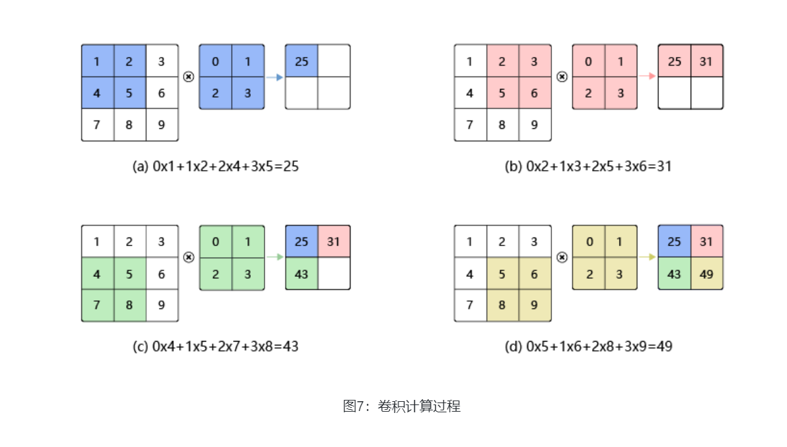
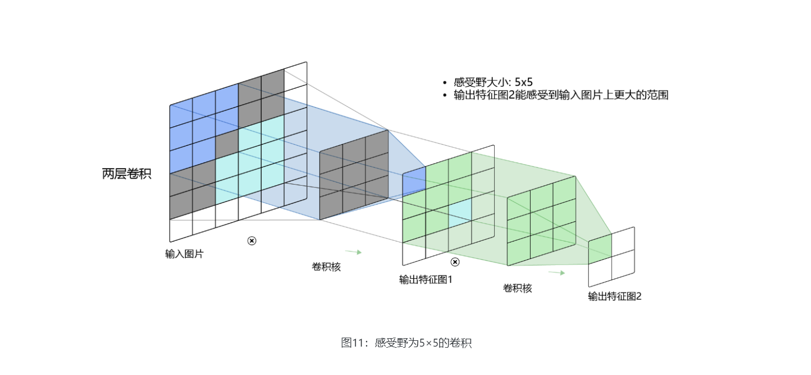
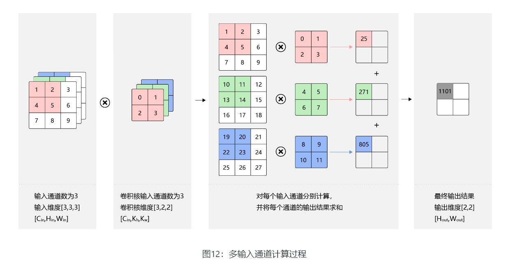
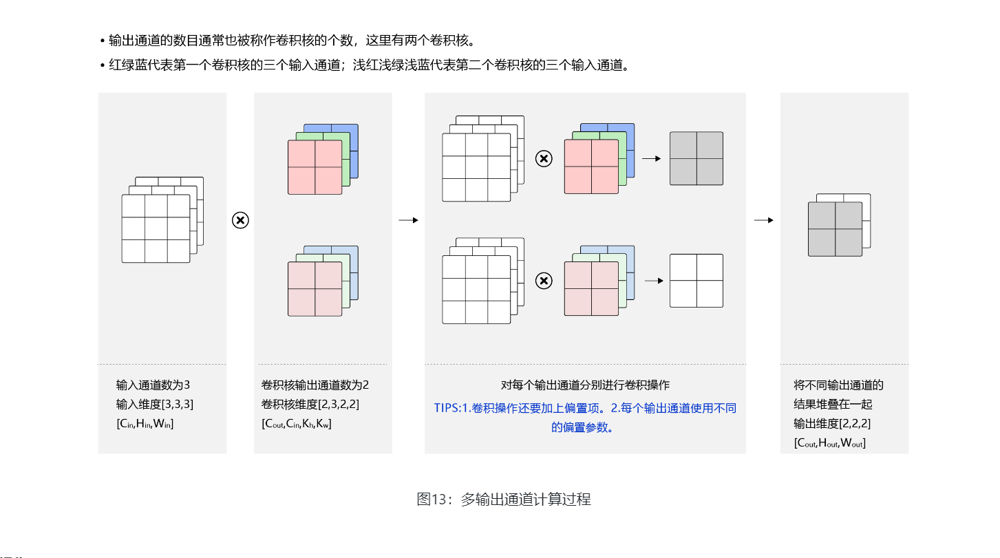
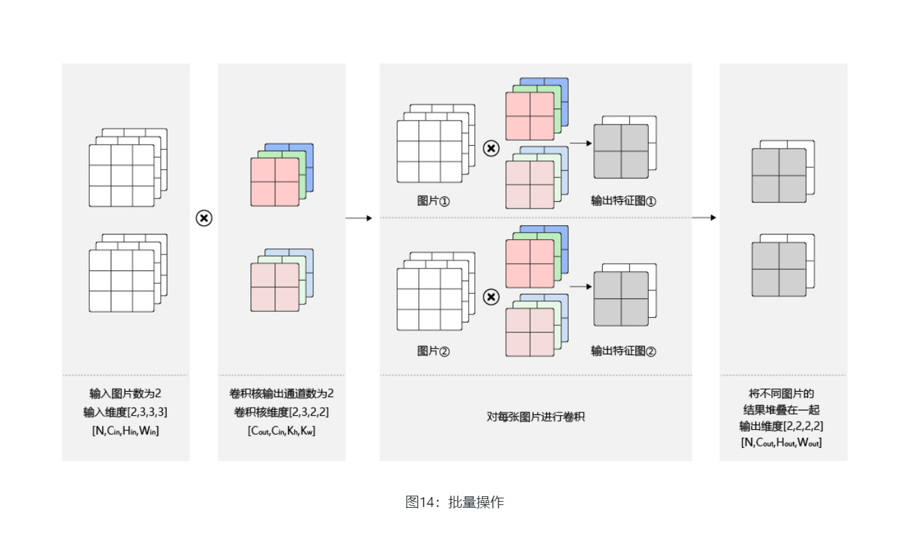
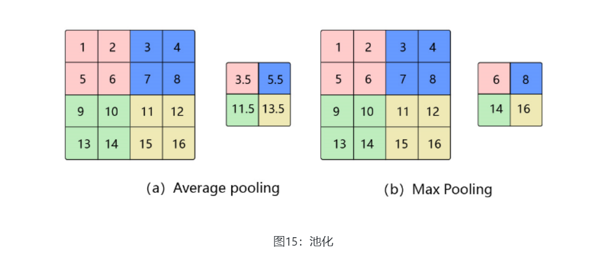
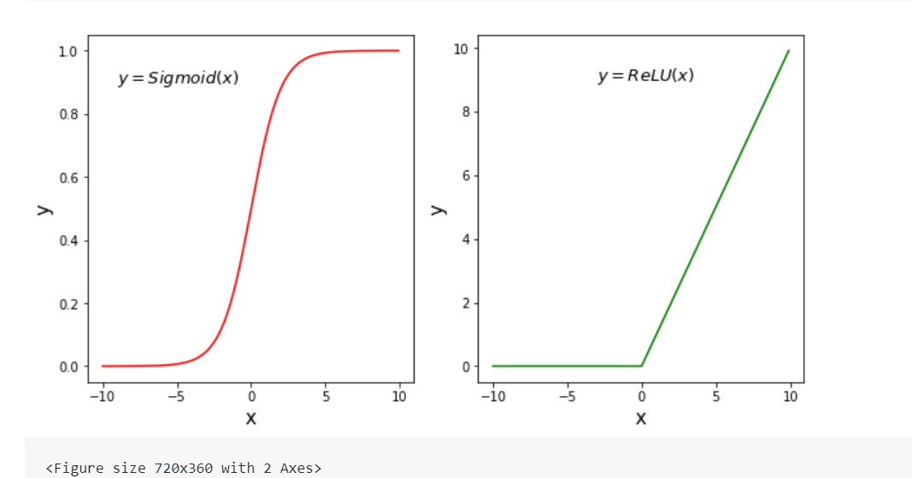

# 计算机视觉

就是让机器去识别摄像机拍摄的图片或视频中的物体，检测出物体所在的位置，并对目标物体进行跟踪，从而理解并描述出图片或视频里的场景和故事，以此来模拟人脑视觉系统。

其目的是建立能够从图像或者视频中“感知”信息的人工系统。

在交通（车牌识别、道路违章抓拍）、安防（人脸闸机、小区监控）、金融（刷脸支付、柜台的自动票据识别）、医疗（医疗影像诊断）、工业生产（产品缺陷自动检测）等多个领域应用，影响或正在改变人们的日常生活和工业生产方式。

# 飞桨

飞桨为计算机视觉任务提供了丰富的API，并通过底层优化和加速保证了这些API的性能。同时，飞桨还提供了丰富的模型库，覆盖图像分类、检测、分割、文字识别和视频理解等多个领域

本章将重点介绍计算机视觉的经典模型（卷积神经网络）和两个典型任务（图像分类和目标检测）

**卷积神经网络** ：卷积神经网络（Convolutional Neural Networks, CNN）是计算机视觉技术最经典的模型结构。本教程主要介绍卷积神经网络的常用模块，包括：卷积、池化、激活函数、批归一化、丢弃法等。

* **图像分类** ：介绍图像分类算法的经典模型结构，包括：LeNet、AlexNet、VGG、GoogLeNet、ResNet，并通过眼疾筛查的案例展示算法的应用。
* **目标检测** ：介绍目标检测YOLOv3算法，并通过林业病虫害检测案例展示YOLOv3算法的应用。

早期计算机视觉子任务

* **(a) Image Classification：** 图像分类，用于识别图像中物体的类别（如：bottle、cup、cube）。
* **(b) Object Localization：** 目标检测，用于检测图像中每个物体的类别，并准确标出它们的位置。
* **© Semantic Segmentation：** 图像语义分割，用于标出图像中每个像素点所属的类别，属于同一类别的像素点用一个颜色标识。
* **(d) Instance Segmentation：** 实例分割，值得注意的是，（b）中的目标检测任务只需要标注出物体位置，而（d）中的实例分割任务不仅要标注出物体位置，还需要标注出物体的外形轮廓。

在早期的图像分类任务中，通常是先人工提取图像特征，再用机器学习算法对这些特征进行分类，分类的结果强依赖于特征提取方法，往往只有经验丰富的研究者才能完成

早期的卷积神经网络处理图像任务

最早将卷积神经网络应用到图像识别领域的，其主要逻辑是使用卷积神经网络提取图像特征，并对图像所属类别进行预测，通过训练数据不断调整网络参数，最终形成一套能自动提取图像特征并对这些特征进行分类的网络

# 卷积神经网络

基础模块：

* 卷积（Convolution）
* 池化（Pooling）
* ReLU激活函数
* 批归一化（Batch Normalization）
* 丢弃法（Dropout）

多层卷积和池化层组合作用在输入图片上，在网络的最后通常会加入一系列全连接层，ReLU激活函数一般加在卷积或者全连接层的输出上，网络中通常还会加入Dropout来防止过拟合。

## 卷积计算convolution

在卷积神经网络中，卷积层的实现方式实际上是数学中定义的互相关 （cross-correlation）运算，与数学分析中的卷积定义有所不同，这里跟其他框架和卷积神经网络的教程保持一致，都使用互相关运算作为卷积的定义

卷积核（kernel）也被叫做滤波器（filter），假设卷积核的高和宽分别为𝑘ℎ和𝑘𝑤，则将称为𝑘ℎ×𝑘𝑤   卷积，比如3×5卷积，就是指卷积核的高为3, 宽为5

在此基础上还可以加上偏置


输入图片高度为H   宽度为W

卷积核的高度为  Kh   宽度为Kw

则输出的图片尺寸为   Hout  =H-Kh+1       Wout=W-Kw+1



## 填充padding(卷积后变小)

输入图片高度为H   宽度为W

卷积核的高度为  Kh   宽度为Kw

则输出的图片尺寸为   Hout  =H-Kh+1       Wout=W-Kw+1

当卷积核尺寸大于1时，输出特征图的尺寸会小于输入图片尺寸。如果经过多次卷积，输出图片尺寸会不断减小。为了避免卷积之后图片尺寸变小，通常会在图片的外围进行填充(padding)

**H**o**u**t=**H**+**p**h**1+**p**h**2−**k**h+**1**

𝑊𝑜𝑢𝑡=𝑊+𝑝𝑤1+𝑝𝑤2−𝑘𝑤+1

等量填充后  输出图片的大小

**H**o**u**t=**H**+**2**p**h**−**k**h+1

𝑊𝑜𝑢𝑡=𝑊+2𝑝𝑤−𝑘𝑤+1

卷积核通常使用1，3，5这样的奇数，填充的大小通常选取为  Ph=(Kh-1)/2    Pw=(Kw-1)/2

这样卷积之后的图像尺寸不变

## 步幅stride

卷积核滑动的像素点，滑动像素点  高度滑动 Sh   宽度滑动Sw

**H**o**u**t= (H+**2**p**h−**k**h**)/Sh+1

Wo**u**t= (W+**2**pw−**kw**)/Sw+1

## 感受野receptive field

输出特征图上每个点的数值，是由输入图片上大小为𝑘ℎ×𝑘𝑤**k**h×**k**w的区域的元素与卷积核每个元素相乘再相加得到的，所以输入图像上𝑘ℎ×𝑘𝑤**k**h×**k**w区域内每个元素数值的改变，都会影响输出点的像素值。我们将这个区域叫做输出特征图上对应点的感受野



当增加卷积网络的深度的同时，感受野会逐渐增大，输出特征图中的一个像素点将会包含更多的图像语义信息

## 多输入通道、多输出通道和批量操作

对于彩色图片有RGB三个通道，需要处理多输入通道的场景，

输出特征图往往也会具有多个通道

而且在神经网络的计算中常常是把一个批次的样本放在一起计算，所以卷积算子需要具有批量处理多输入和多输出通道数据的功能

### 多输入通道场景

假设输入图片的通道数为𝐶𝑖𝑛，输入数据的形状是𝐶𝑖𝑛×𝐻𝑖𝑛×𝑊𝑖𝑛

1 对每个通道分别设计一个2维数组作为卷积核，卷积核数组的形状是𝐶𝑖𝑛×𝑘ℎ×𝑘𝑤

2 对任一通道𝐶𝑖𝑛∈[0,𝐶𝑖𝑛)，分别用大小为𝑘ℎ×𝑘𝑤的卷积核在大小为𝐻𝑖𝑛×𝑊𝑖𝑛的二维数组上做卷积

3 将这𝐶𝑖𝑛个通道的计算结果相加，得到的是一个形状为𝐻𝑜𝑢𝑡×𝑊𝑜𝑢𝑡的二维数组



### 多输出通道场景  通常将卷积核的输出通道数叫做卷积核的个数。

卷积操作的输出特征图也会具有多个通道𝐶𝑜𝑢𝑡

这时我们需要设计𝐶𝑜𝑢𝑡个维度为𝐶𝑖𝑛×𝑘ℎ×𝑘𝑤的卷积核

卷积核数组的维度是𝐶𝑜𝑢𝑡×𝐶𝑖𝑛×𝑘ℎ×𝑘𝑤

1 对任一输出通道𝐶𝑜𝑢𝑡∈[0,𝐶𝑜𝑢𝑡)，分别使用上面描述的形状为𝐶𝑖𝑛×𝑘ℎ×𝑘𝑤的卷积核对输入图片做卷积。

2 将这𝐶𝑜𝑢𝑡个形状为𝐻𝑜𝑢𝑡×𝑊𝑜𝑢𝑡的二维数组拼接在一起，形成维度为𝐶𝑜𝑢𝑡×𝐻𝑜𝑢𝑡×𝑊𝑜𝑢𝑡的三维数组。



## 批量操作

在卷积神经网络的计算中，通常将多个样本放在一起形成一个mini-batch进行批量操作，

即输入数据的维度是𝑁×𝐶𝑖𝑛×𝐻𝑖𝑛×𝑊𝑖𝑛

由于会对每张图片使用同样的卷积核进行卷积操作，卷积核的维度与上面多输出通道的情况一样，仍然是𝐶𝑜𝑢𝑡×𝐶𝑖𝑛×𝑘ℎ×𝑘𝑤



## 飞桨卷积API介绍

飞桨卷积算子对应的API是[paddle.nn.Conv2D](https://www.paddlepaddle.org.cn/documentation/docs/zh/api/paddle/nn/Conv2D_cn.html)

Conv2D名称中的“2D”表明卷积核是二维的，多用于处理图像数据。类似的，也有Conv3D可以用于处理视频数据（图像的序列）。

```
*class* paddle.nn.Conv2D ( *in_channels, out_channels, kernel_size, stride=1, padding=0, dilation=1, groups=1, padding_mode=‘zeros’, weight_attr=None, bias_attr=None, data_format=‘NCHW’* )
```

* in_channels(int) - 输入图像的通道数。
* out_channels(int) - 卷积核的个数，和输出特征图通道数相同，相当于上文中的𝐶𝑜𝑢𝑡**C**o**u**t。
* kernel_size(int|list|tuple) - 卷积核大小，可以是整数，比如3，表示卷积核的高和宽均为3 ；或者是两个整数的list，例如[3,2]，表示卷积核的高为3，宽为2。
* stride(int|list|tuple，可选) - 步长大小，可以是整数，默认值为1，表示垂直和水平滑动步幅均为1；或者是两个整数的list，例如[3,2]，表示垂直滑动步幅为3，水平滑动步幅为2。
* padding(int|list|tuple|str，可选) - 填充大小，可以是整数，比如1，表示竖直和水平边界填充大小均为1；或者是两个整数的list，例如[2,1]，表示竖直边界填充大小为2，水平边界填充大小为1。

输入数据维度[𝑁,𝐶𝑖𝑛,𝐻𝑖𝑛,𝑊𝑖𝑛]，输出数据维度[𝑁,𝑜𝑢𝑡_𝑐ℎ𝑎𝑛𝑛𝑒𝑙𝑠,𝐻𝑜𝑢𝑡,𝑊𝑜𝑢𝑡]_，权重参数𝑤的维度[𝑜𝑢𝑡_𝑐ℎ𝑎𝑛𝑛𝑒𝑙𝑠,  𝐶𝑖𝑛,   𝑓𝑖𝑙𝑡𝑒𝑟_𝑠𝑖𝑧𝑒_ℎ,  𝑓𝑖𝑙𝑡𝑒𝑟_𝑠𝑖𝑧𝑒_𝑤]_**，**偏置参数𝑏b的维度是[𝑜𝑢𝑡_𝑐ℎ𝑎𝑛𝑛𝑒𝑙𝑠]。注意，即使输入只有一张灰度图片[𝐻𝑖𝑛,𝑊𝑖𝑛]，也需要处理成四个维度的输入向量[1,1,𝐻𝑖𝑛,𝑊𝑖𝑛]。

```
import matplotlib.pyplot as plt
import numpy as np
import paddle
from paddle.nn import Conv2D
from paddle.nn.initializer import Assign
%matplotlib inline

# 创建初始化权重参数w
w = np.array([1, 0, -1], dtype='float32')
# 将权重参数调整成维度为[cout, cin, kh, kw]的四维张量
w = w.reshape([1, 1, 1, 3])
# 创建卷积算子，设置输出通道数，卷积核大小，和初始化权重参数
# kernel_size = [1, 3]表示kh = 1, kw=3
# 创建卷积算子的时候，通过参数属性weight_attr指定参数初始化方式
# 这里的初始化方式时，从numpy.ndarray初始化卷积参数
conv = Conv2D(in_channels=1, out_channels=1, kernel_size=[1, 3],
       weight_attr=paddle.ParamAttr(
          initializer=Assign(value=w)))

# 创建输入图片，图片左边的像素点取值为1，右边的像素点取值为0
img = np.ones([50,50], dtype='float32')
img[:, 30:] = 0.
# 将图片形状调整为[N, C, H, W]的形式
x = img.reshape([1,1,50,50])
# 将numpy.ndarray转化成paddle中的tensor
x = paddle.to_tensor(x)
# 使用卷积算子作用在输入图片上
y = conv(x)
# 将输出tensor转化为numpy.ndarray
out = y.numpy()
f = plt.subplot(121)
f.set_title('input image', fontsize=15)
plt.imshow(img, cmap='gray')
f = plt.subplot(122)
f.set_title('output featuremap', fontsize=15)
# 卷积算子Conv2D输出数据形状为[N, C, H, W]形式
# 此处N, C=1，输出数据形状为[1, 1, H, W]，是4维数组
# 但是画图函数plt.imshow画灰度图时，只接受2维数组
# 通过numpy.squeeze函数将大小为1的维度消除
plt.imshow(out.squeeze(), cmap='gray')
plt.show()
```

```
# 查看卷积层的权重参数名字和数值
print(conv.weight)
# 参看卷积层的偏置参数名字和数值
print(conv.bias)
```

# 池化pooling

池化是使用某一位置的相邻输出的总体统计特征代替网络在该位置的输出，其好处是当输入数据做出少量平移时，经过池化函数后的大多数输出还能保持不变

比如：当识别一张图像是否是人脸时，我们需要知道人脸左边有一只眼睛，右边也有一只眼睛，而不需要知道眼睛的精确位置，这时候通过池化某一片区域的像素点来得到总体统计特征会显得很有用。

由于池化之后特征图会变得更小，如果后面连接的是全连接层，能有效的减小神经元的个数，节省存储空间并提高计算效率

平均池化  和最大池化    池化窗口的概念   




在卷积神经网络中，通常使用2×2大小的池化窗口，步幅也使用2，填充为0，则输出特征图的尺寸为：

𝐻𝑜𝑢𝑡=𝐻/2

𝑊𝑜𝑢𝑡=𝑊/2

通过这种方式的池化，输出特征图的高和宽都减半，但通道数不会改变


# ReLU激活函数

在神经网络发展的早期，Sigmoid函数用的比较多，而目前用的较多的激活函数是ReLU。这是因为Sigmoid函数在反向传播过程中，容易造成梯度的衰减。




由于最开始是将神经网络的参数随机初始化的，𝑥的取值很有可能在很大或者很小的区域，这些地方都可能造成Sigmoid函数的导数接近于0，导致𝑥的梯度接近于0；即使𝑥取值在接近于0的地方，按上面的分析，经过Sigmoid函数反向传播之后，𝑥的梯度不超过𝑦的梯度的1/4，如果有多层网络使用了Sigmoid激活函数，则比较靠后的那些层梯度将衰减到非常小的值。

ReLU函数则不同，虽然在𝑥<0的地方，ReLU函数的导数为0。但是在𝑥≥0的地方，ReLU函数的导数为1，能够将𝑦的梯度完整的传递给𝑥，而不会引起梯度消失。


# 批归一化（Batch Normalization）

其目的是对神经网络中间层的输出进行标准化处理，使得中间层的输出更加稳定。

通常我们会对神经网络的数据进行标准化处理，处理后的样本数据集满足均值为0，方差为1的统计分布，这是因为当输入数据的分布比较固定时，有利于算法的稳定和收敛。

对于深度神经网络来说，由于参数是不断更新的，即使输入数据已经做过标准化处理，但是对于比较靠后的那些层，其接收到的输入仍然是剧烈变化的，通常会导致数值不稳定，模型很难收敛。

三个有点

* 使学习快速进行（能够使用较大的学习率）
* 降低模型对初始值的敏感性
* 从一定程度上抑制过拟合

BatchNorm主要思路是在训练时以mini-batch为单位，对神经元的数值进行归一化，使数据的分布满足均值为0，方差为1


# 丢弃法（Dropout）

丢弃法（Dropout）是深度学习中一种常用的抑制过拟合的方法，其做法是在神经网络学习过程中，随机删除一部分神经元。训练时，随机选出一部分神经元，将其输出设置为0，这些神经元将不对外传递信号。

丢弃哪些神经元是随机决定，因此模型不会过度依赖某些神经元，能一定程度上抑制过拟合

丢弃法带来的问题：在预测场景时，会向前传递所有神经元的信号，可能会引出一个新的问题：训练时由于部分神经元被随机丢弃了，输出数据的总大小会变小。

飞桨解决这个问题

* **downscale_in_infer**

训练时以比例𝑟随机丢弃一部分神经元，不向后传递它们的信号；预测时向后传递所有神经元的信号，但是将每个神经元上的数值乘以 (1−𝑟)。

* **upscale_in_train**

训练时以比例𝑟随机丢弃一部分神经元，不向后传递它们的信号，但是将那些被保留的神经元上的数值除以 (1−𝑟)；预测时向后传递所有神经元的信号，不做任何处理。

```
paddle.nn.Dropout(p=0.5, axis=None, mode="upscale_in_train”, name=None)
```
