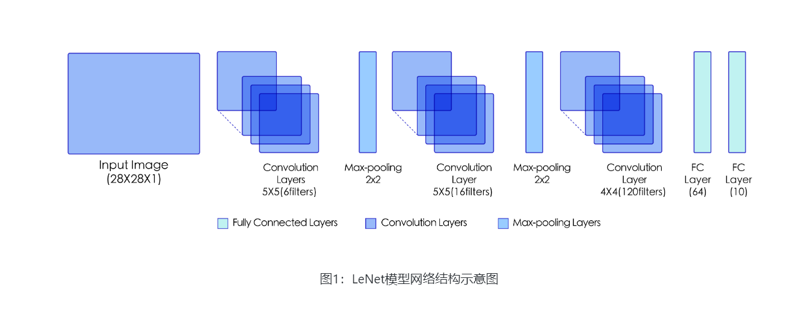
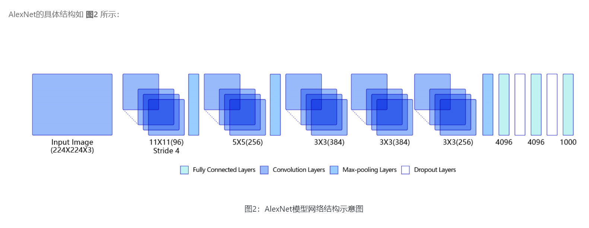
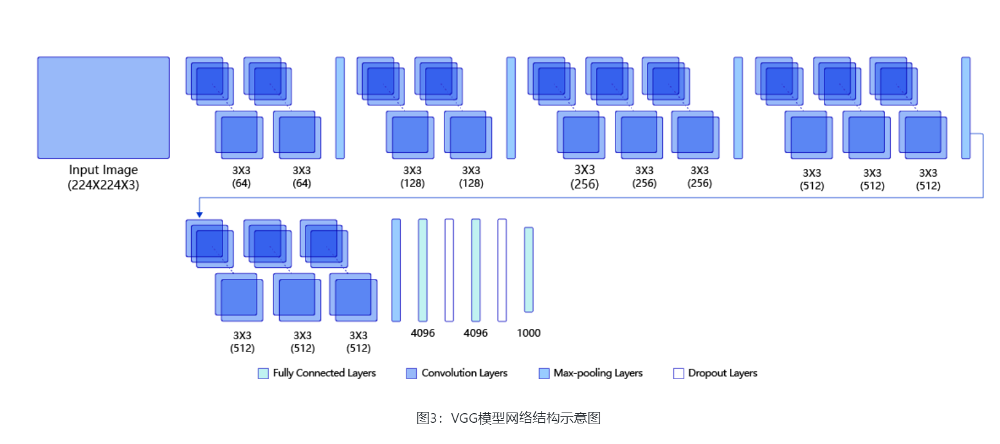
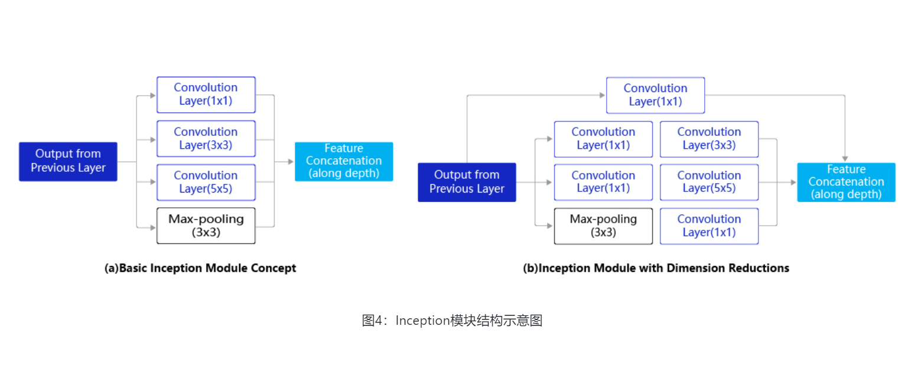
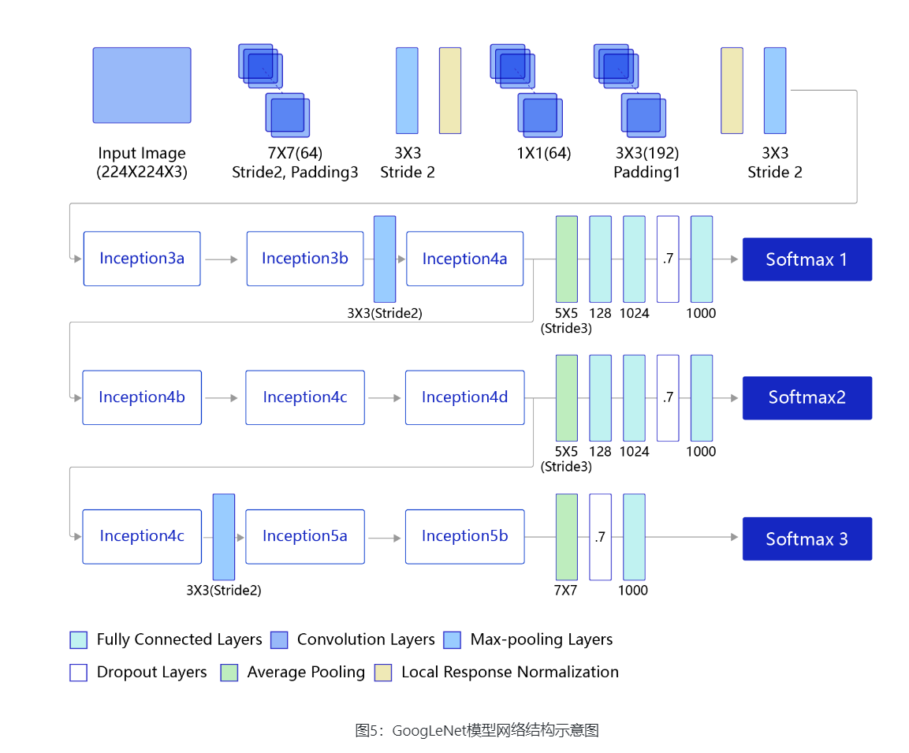
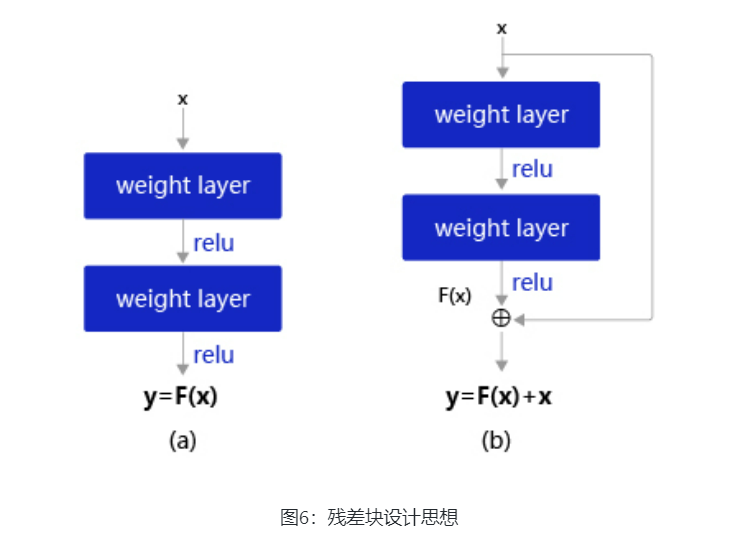

**图像分类**是根据图像的语义信息对不同类别图像进行区分，是计算机视觉的核心，是物体检测、图像分割、物体跟踪、行为分析、人脸识别等其他高层次视觉任务的基础。

基于眼疾分类数据集iChallenge-PM，对图像分类领域的经典卷积神经网络进行剖析，介绍如何应用这些基础模块构建卷积神经网络，解决图像分类问题。

# LeNet

LeNet通过连续使用卷积和池化层的组合提取图像特征



* 第一模块：包含5×5的6通道卷积和2×2的池化。卷积提取图像中包含的特征模式（激活函数使用Sigmoid），图像尺寸从28减小到24。经过池化层可以降低输出特征图对空间位置的敏感性，图像尺寸减到12。
* 第二模块：和第一模块尺寸相同，通道数由6增加为16。卷积操作使图像尺寸减小到8，经过池化后变成4。
* 第三模块：包含4×4的120通道卷积。卷积之后的图像尺寸减小到1，但是通道数增加为120。将经过第3次卷积提取到的特征图输入到全连接层。第一个全连接层的输出神经元的个数是64，第二个全连接层的输出神经元个数是分类标签的类别数，对于手写数字识别的类别数是10。然后使用Softmax激活函数即可计算出每个类别的预测概率。

## LeNet在手写数字识别上的应用

```
# 导入需要的包
import paddle
import numpy as np
from paddle.nn import Conv2D, MaxPool2D, Linear

## 组网
import paddle.nn.functional as F

# 定义 LeNet 网络结构
class LeNet(paddle.nn.Layer):
    def __init__(self, num_classes=1):
        super(LeNet, self).__init__()
        # 创建卷积和池化层
        # 创建第1个卷积层
        self.conv1 = Conv2D(in_channels=1, out_channels=6, kernel_size=5)
        self.max_pool1 = MaxPool2D(kernel_size=2, stride=2)
        # 尺寸的逻辑：池化层未改变通道数；当前通道数为6
        # 创建第2个卷积层
        self.conv2 = Conv2D(in_channels=6, out_channels=16, kernel_size=5)
        self.max_pool2 = MaxPool2D(kernel_size=2, stride=2)
        # 创建第3个卷积层
        self.conv3 = Conv2D(in_channels=16, out_channels=120, kernel_size=4)
        # 尺寸的逻辑：输入层将数据拉平[B,C,H,W] -> [B,C*H*W]
        # 输入size是[28,28]，经过三次卷积和两次池化之后，C*H*W等于120
        self.fc1 = Linear(in_features=120, out_features=64)
        # 创建全连接层，第一个全连接层的输出神经元个数为64， 第二个全连接层输出神经元个数为分类标签的类别数
        self.fc2 = Linear(in_features=64, out_features=num_classes)
    # 网络的前向计算过程
    def forward(self, x):
        x = self.conv1(x)
        # 每个卷积层使用Sigmoid激活函数，后面跟着一个2x2的池化
        x = F.sigmoid(x)
        x = self.max_pool1(x)
        x = F.sigmoid(x)
        x = self.conv2(x)
        x = self.max_pool2(x)
        x = self.conv3(x)
        # 尺寸的逻辑：输入层将数据拉平[B,C,H,W] -> [B,C*H*W]
        x = paddle.reshape(x, [x.shape[0], -1])
        x = self.fc1(x)
        x = F.sigmoid(x)
        x = self.fc2(x)
        return x
```

# AlexNet

AlexNet与LeNet相比，具有更深的网络结构，包含5层卷积和3层全连接，同时使用了如下三种方法改进模型的训练过程：

* 数据增广：深度学习中常用的一种处理方式，通过对训练随机加一些变化，比如平移、缩放、裁剪、旋转、翻转或者增减亮度等，产生一系列跟原始图片相似但又不完全相同的样本，从而扩大训练数据集。通过这种方式，可以随机改变训练样本，避免模型过度依赖于某些属性，能从一定程度上抑制过拟合。
* 使用Dropout抑制过拟合。
* 使用ReLU激活函数减少梯度消失现象。



```
# -*- coding:utf-8 -*-

# 导入需要的包
import paddle
import numpy as np
from paddle.nn import Conv2D, MaxPool2D, Linear, Dropout
## 组网
import paddle.nn.functional as F

# 定义 AlexNet 网络结构
class AlexNet(paddle.nn.Layer):
    def __init__(self, num_classes=1):
        super(AlexNet, self).__init__()
        # AlexNet与LeNet一样也会同时使用卷积和池化层提取图像特征
        # 与LeNet不同的是激活函数换成了‘relu’
        self.conv1 = Conv2D(in_channels=3, out_channels=96, kernel_size=11, stride=4, padding=5)
        self.max_pool1 = MaxPool2D(kernel_size=2, stride=2)
        self.conv2 = Conv2D(in_channels=96, out_channels=256, kernel_size=5, stride=1, padding=2)
        self.max_pool2 = MaxPool2D(kernel_size=2, stride=2)
        self.conv3 = Conv2D(in_channels=256, out_channels=384, kernel_size=3, stride=1, padding=1)
        self.conv4 = Conv2D(in_channels=384, out_channels=384, kernel_size=3, stride=1, padding=1)
        self.conv5 = Conv2D(in_channels=384, out_channels=256, kernel_size=3, stride=1, padding=1)
        self.max_pool5 = MaxPool2D(kernel_size=2, stride=2)

        self.fc1 = Linear(in_features=12544, out_features=4096)
        self.drop_ratio1 = 0.5
        self.drop1 = Dropout(self.drop_ratio1)
        self.fc2 = Linear(in_features=4096, out_features=4096)
        self.drop_ratio2 = 0.5
        self.drop2 = Dropout(self.drop_ratio2)
        self.fc3 = Linear(in_features=4096, out_features=num_classes)
  
    def forward(self, x):
        x = self.conv1(x)
        x = F.relu(x)
        x = self.max_pool1(x)
        x = self.conv2(x)
        x = F.relu(x)
        x = self.max_pool2(x)
        x = self.conv3(x)
        x = F.relu(x)
        x = self.conv4(x)
        x = F.relu(x)
        x = self.conv5(x)
        x = F.relu(x)
        x = self.max_pool5(x)
        x = paddle.reshape(x, [x.shape[0], -1])
        x = self.fc1(x)
        x = F.relu(x)
        # 在全连接之后使用dropout抑制过拟合
        x = self.drop1(x)
        x = self.fc2(x)
        x = F.relu(x)
        # 在全连接之后使用dropout抑制过拟合
        x = self.drop2(x)
        x = self.fc3(x)
        return x
```

```
# 创建模型
model = AlexNet()
# 启动训练过程
opt = paddle.optimizer.Adam(learning_rate=0.001, parameters=model.parameters())

train_pm(model, optimizer=opt)
```

通过运行结果可以发现，在眼疾筛查数据集iChallenge-PM上使用AlexNet，loss能有效下降，经过5个epoch的训练，在验证集上的准确率可以达到94%左右。

# VGG

VGG是当前最流行的CNN模型之一，VGG通过使用一系列大小为3x3的小尺寸卷积核和池化层构造深度卷积神经网络，并取得了较好的效果。VGG模型因为结构简单、应用性极强而广受研究者欢迎，尤其是它的网络结构设计方法，为构建深度神经网络提供了方向。



```
# -*- coding:utf-8 -*-

# VGG模型代码
import numpy as np
import paddle
# from paddle.nn import Conv2D, MaxPool2D, BatchNorm, Linear
from paddle.nn import Conv2D, MaxPool2D, BatchNorm2D, Linear

# 定义vgg网络
class VGG(paddle.nn.Layer):
    def __init__(self):
        super(VGG, self).__init__()

        in_channels = [3, 64, 128, 256, 512, 512]
        # 定义第一个block，包含两个卷积
        self.conv1_1 = Conv2D(in_channels=in_channels[0], out_channels=in_channels[1], kernel_size=3, padding=1, stride=1)
        self.conv1_2 = Conv2D(in_channels=in_channels[1], out_channels=in_channels[1], kernel_size=3, padding=1, stride=1)
        # 定义第二个block，包含两个卷积
        self.conv2_1 = Conv2D(in_channels=in_channels[1], out_channels=in_channels[2], kernel_size=3, padding=1, stride=1)
        self.conv2_2 = Conv2D(in_channels=in_channels[2], out_channels=in_channels[2], kernel_size=3, padding=1, stride=1)
        # 定义第三个block，包含三个卷积
        self.conv3_1 = Conv2D(in_channels=in_channels[2], out_channels=in_channels[3], kernel_size=3, padding=1, stride=1)
        self.conv3_2 = Conv2D(in_channels=in_channels[3], out_channels=in_channels[3], kernel_size=3, padding=1, stride=1)
        self.conv3_3 = Conv2D(in_channels=in_channels[3], out_channels=in_channels[3], kernel_size=3, padding=1, stride=1)
        # 定义第四个block，包含三个卷积
        self.conv4_1 = Conv2D(in_channels=in_channels[3], out_channels=in_channels[4], kernel_size=3, padding=1, stride=1)
        self.conv4_2 = Conv2D(in_channels=in_channels[4], out_channels=in_channels[4], kernel_size=3, padding=1, stride=1)
        self.conv4_3 = Conv2D(in_channels=in_channels[4], out_channels=in_channels[4], kernel_size=3, padding=1, stride=1)
        # 定义第五个block，包含三个卷积
        self.conv5_1 = Conv2D(in_channels=in_channels[4], out_channels=in_channels[5], kernel_size=3, padding=1, stride=1)
        self.conv5_2 = Conv2D(in_channels=in_channels[5], out_channels=in_channels[5], kernel_size=3, padding=1, stride=1)
        self.conv5_3 = Conv2D(in_channels=in_channels[5], out_channels=in_channels[5], kernel_size=3, padding=1, stride=1)

        # 使用Sequential 将全连接层和relu组成一个线性结构（fc + relu）
        # 当输入为224x224时，经过五个卷积块和池化层后，特征维度变为[512x7x7]
        self.fc1 = paddle.nn.Sequential(paddle.nn.Linear(512 * 7 * 7, 4096), paddle.nn.ReLU())
        self.drop1_ratio = 0.5
        self.dropout1 = paddle.nn.Dropout(self.drop1_ratio, mode='upscale_in_train')
        # 使用Sequential 将全连接层和relu组成一个线性结构（fc + relu）
        self.fc2 = paddle.nn.Sequential(paddle.nn.Linear(4096, 4096), paddle.nn.ReLU())

        self.drop2_ratio = 0.5
        self.dropout2 = paddle.nn.Dropout(self.drop2_ratio, mode='upscale_in_train')
        self.fc3 = paddle.nn.Linear(4096, 1)

        self.relu = paddle.nn.ReLU()
        self.pool = MaxPool2D(stride=2, kernel_size=2)

    def forward(self, x):
        x = self.relu(self.conv1_1(x))
        x = self.relu(self.conv1_2(x))
        x = self.pool(x)

        x = self.relu(self.conv2_1(x))
        x = self.relu(self.conv2_2(x))
        x = self.pool(x)

        x = self.relu(self.conv3_1(x))
        x = self.relu(self.conv3_2(x))
        x = self.relu(self.conv3_3(x))
        x = self.pool(x)

        x = self.relu(self.conv4_1(x))
        x = self.relu(self.conv4_2(x))
        x = self.relu(self.conv4_3(x))
        x = self.pool(x)

        x = self.relu(self.conv5_1(x))
        x = self.relu(self.conv5_2(x))
        x = self.relu(self.conv5_3(x))
        x = self.pool(x)

        x = paddle.flatten(x, 1, -1)
        x = self.dropout1(self.relu(self.fc1(x)))
        x = self.dropout2(self.relu(self.fc2(x)))
        x = self.fc3(x)
        return x
```

```
# 创建模型
model = VGG()
# opt = paddle.optimizer.Adam(learning_rate=0.001, parameters=model.parameters())
opt = paddle.optimizer.Momentum(learning_rate=0.001, momentum=0.9, parameters=model.parameters())

# 启动训练过程
train_pm(model, opt)
```

通过运行结果可以发现，在眼疾筛查数据集iChallenge-PM上使用VGG，loss能有效的下降，经过5个epoch的训练，在验证集上的准确率可以达到94%左右。


# GoogLeNet

它的主要特点是网络不仅有深度，还在横向上具有“宽度”。由于图像信息在空间尺寸上的巨大差异，如何选择合适的卷积核来提取特征就显得比较困难了。空间分布范围更广的图像信息适合用较大的卷积核来提取其特征；而空间分布范围较小的图像信息则适合用较小的卷积核来提取其特征







# ResNet  残差网络


随着深度学习的不断发展，模型的层数越来越多，网络结构也越来越复杂。那么是否加深网络结构，就一定会得到更好的效果呢？

从理论上来说，假设新增加的层都是恒等映射，只要原有的层学出跟原模型一样的参数，那么深模型结构就能达到原模型结构的效果。换句话说，原模型的解只是新模型的解的子空间，在新模型解的空间里应该能找到比原模型解对应的子空间更好的结果。但是实践表明，增加网络的层数之后，训练误差往往不降反升。

残差网络ResNet来解决上述问题



* 图6(a)：表示增加网络的时候，将𝑥映射成𝑦=𝐹(𝑥)输出。
* 图6(b)：对图6(a)作了改进，输出𝑦=𝐹(𝑥)+𝑥。这时不是直接学习输出特征𝑦的表示，而是学习𝑦−。
  * 如果想学习出原模型的表示，只需将𝐹(𝑥)的参数全部设置为0，则𝑦=𝑥恒等映射。
  * 𝐹(𝑥)=𝑦−𝑥也叫做残差项，如果𝑥→𝑦的映射接近恒等映射，图6(b)中通过学习残差项也比图6(a)学习完整映射形式更加容易。

ResNet每层都存在直连的旁路，相当于每一层都和最终的损失有“直接对话”的机会，自然可以更好的解决梯度弥散的问题。


ResNet-50的结构，一共包含49层卷积和1层全连接，所以被称为ResNet-50


```
# -*- coding:utf-8 -*-

# ResNet模型代码
import numpy as np
import paddle
import paddle.nn as nn
import paddle.nn.functional as F

# ResNet中使用了BatchNorm层，在卷积层的后面加上BatchNorm以提升数值稳定性
# 定义卷积批归一化块
class ConvBNLayer(paddle.nn.Layer):
    def __init__(self,
                 num_channels,
                 num_filters,
                 filter_size,
                 stride=1,
                 groups=1,
                 act=None):
     
        """
        num_channels, 卷积层的输入通道数
        num_filters, 卷积层的输出通道数
        stride, 卷积层的步幅
        groups, 分组卷积的组数，默认groups=1不使用分组卷积
        """
        super(ConvBNLayer, self).__init__()

        # 创建卷积层
        self._conv = nn.Conv2D(
            in_channels=num_channels,
            out_channels=num_filters,
            kernel_size=filter_size,
            stride=stride,
            padding=(filter_size - 1) // 2,
            groups=groups,
            bias_attr=False)

        # 创建BatchNorm层
        self._batch_norm = paddle.nn.BatchNorm2D(num_filters)
      
        self.act = act

    def forward(self, inputs):
        y = self._conv(inputs)
        y = self._batch_norm(y)
        if self.act == 'leaky':
            y = F.leaky_relu(x=y, negative_slope=0.1)
        elif self.act == 'relu':
            y = F.relu(x=y)
        return y

# 定义残差块
# 每个残差块会对输入图片做三次卷积，然后跟输入图片进行短接
# 如果残差块中第三次卷积输出特征图的形状与输入不一致，则对输入图片做1x1卷积，将其输出形状调整成一致
class BottleneckBlock(paddle.nn.Layer):
    def __init__(self,
                 num_channels,
                 num_filters,
                 stride,
                 shortcut=True):
        super(BottleneckBlock, self).__init__()
        # 创建第一个卷积层 1x1
        self.conv0 = ConvBNLayer(
            num_channels=num_channels,
            num_filters=num_filters,
            filter_size=1,
            act='relu')
        # 创建第二个卷积层 3x3
        self.conv1 = ConvBNLayer(
            num_channels=num_filters,
            num_filters=num_filters,
            filter_size=3,
            stride=stride,
            act='relu')
        # 创建第三个卷积 1x1，但输出通道数乘以4
        self.conv2 = ConvBNLayer(
            num_channels=num_filters,
            num_filters=num_filters * 4,
            filter_size=1,
            act=None)

        # 如果conv2的输出跟此残差块的输入数据形状一致，则shortcut=True
        # 否则shortcut = False，添加1个1x1的卷积作用在输入数据上，使其形状变成跟conv2一致
        if not shortcut:
            self.short = ConvBNLayer(
                num_channels=num_channels,
                num_filters=num_filters * 4,
                filter_size=1,
                stride=stride)

        self.shortcut = shortcut

        self._num_channels_out = num_filters * 4

    def forward(self, inputs):
        y = self.conv0(inputs)
        conv1 = self.conv1(y)
        conv2 = self.conv2(conv1)

        # 如果shortcut=True，直接将inputs跟conv2的输出相加
        # 否则需要对inputs进行一次卷积，将形状调整成跟conv2输出一致
        if self.shortcut:
            short = inputs
        else:
            short = self.short(inputs)

        y = paddle.add(x=short, y=conv2)
        y = F.relu(y)
        return y

# 定义ResNet模型
class ResNet(paddle.nn.Layer):
    def __init__(self, layers=50, class_dim=1):
        """
      
        layers, 网络层数，可以是50, 101或者152
        class_dim，分类标签的类别数
        """
        super(ResNet, self).__init__()
        self.layers = layers
        supported_layers = [50, 101, 152]
        assert layers in supported_layers, \
            "supported layers are {} but input layer is {}".format(supported_layers, layers)

        if layers == 50:
            #ResNet50包含多个模块，其中第2到第5个模块分别包含3、4、6、3个残差块
            depth = [3, 4, 6, 3]
        elif layers == 101:
            #ResNet101包含多个模块，其中第2到第5个模块分别包含3、4、23、3个残差块
            depth = [3, 4, 23, 3]
        elif layers == 152:
            #ResNet152包含多个模块，其中第2到第5个模块分别包含3、8、36、3个残差块
            depth = [3, 8, 36, 3]
      
        # 残差块中使用到的卷积的输出通道数
        num_filters = [64, 128, 256, 512]

        # ResNet的第一个模块，包含1个7x7卷积，后面跟着1个最大池化层
        self.conv = ConvBNLayer(
            num_channels=3,
            num_filters=64,
            filter_size=7,
            stride=2,
            act='relu')
        self.pool2d_max = nn.MaxPool2D(
            kernel_size=3,
            stride=2,
            padding=1)

        # ResNet的第二到第五个模块c2、c3、c4、c5
        self.bottleneck_block_list = []
        num_channels = 64
        for block in range(len(depth)):
            shortcut = False
            for i in range(depth[block]):
                # c3、c4、c5将会在第一个残差块使用stride=2；其余所有残差块stride=1
                bottleneck_block = self.add_sublayer(
                    'bb_%d_%d' % (block, i),
                    BottleneckBlock(
                        num_channels=num_channels,
                        num_filters=num_filters[block],
                        stride=2 if i == 0 and block != 0 else 1, 
                        shortcut=shortcut))
                num_channels = bottleneck_block._num_channels_out
                self.bottleneck_block_list.append(bottleneck_block)
                shortcut = True

        # 在c5的输出特征图上使用全局池化
        self.pool2d_avg = paddle.nn.AdaptiveAvgPool2D(output_size=1)

        # stdv用来作为全连接层随机初始化参数的方差
        import math
        stdv = 1.0 / math.sqrt(2048 * 1.0)
      
        # 创建全连接层，输出大小为类别数目，经过残差网络的卷积和全局池化后，
        # 卷积特征的维度是[B,2048,1,1]，故最后一层全连接的输入维度是2048
        self.out = nn.Linear(in_features=2048, out_features=class_dim,
                      weight_attr=paddle.ParamAttr(
                          initializer=paddle.nn.initializer.Uniform(-stdv, stdv)))

    def forward(self, inputs):
        y = self.conv(inputs)
        y = self.pool2d_max(y)
        for bottleneck_block in self.bottleneck_block_list:
            y = bottleneck_block(y)
        y = self.pool2d_avg(y)
        y = paddle.reshape(y, [y.shape[0], -1])
        y = self.out(y)
        return y
```

```
# 创建模型
model = ResNet()
# 定义优化器
opt = paddle.optimizer.Momentum(learning_rate=0.001, momentum=0.9, parameters=model.parameters(), weight_decay=0.001)
# 启动训练过程
train_pm(model, opt)
```


# 使用飞桨高层API直接调用图像分类网络

高层API支持paddle.vision.models接口，实现了对常用模型的封装，包括ResNet、VGG、MobileNet、LeNet等。使用高层API调用这些网络，可以快速完成神经网络的训练和Fine-tune。


```
import paddle
from paddle.vision.models import resnet50

# 调用高层API的resnet50模型
model = resnet50()
# 设置pretrained参数为True，可以加载resnet50在imagenet数据集上的预训练模型
# model = resnet50(pretrained=True)

# 随机生成一个输入
x = paddle.rand([1, 3, 224, 224])
# 得到残差50的计算结果
out = model(x)
# 打印输出的形状，由于resnet50默认的是1000分类
# 所以输出shape是[1x1000]
print(out.shape)
```

使用paddle.vision中的模型可以简单快速的构建一个深度学习任务，如下示例，仅14行代码即可实现resnet在Cifar10数据集上的训练。


```
# 从paddle.vision.models 模块中import 残差网络，VGG网络，LeNet网络
from paddle.vision.models import resnet50, vgg16, LeNet
from paddle.vision.datasets import Cifar10
from paddle.optimizer import Momentum
from paddle.regularizer import L2Decay
from paddle.nn import CrossEntropyLoss
from paddle.metric import Accuracy
from paddle.vision.transforms import Transpose

# 确保从paddle.vision.datasets.Cifar10中加载的图像数据是np.ndarray类型
paddle.vision.set_image_backend('cv2')
# 调用resnet50模型
model = paddle.Model(resnet50(pretrained=False, num_classes=10))

# 使用Cifar10数据集
train_dataset = Cifar10(mode='train', transform=Transpose())
val_dataset = Cifar10(mode='test', transform=Transpose())
# 定义优化器
optimizer = Momentum(learning_rate=0.01,
                     momentum=0.9,
                     weight_decay=L2Decay(1e-4),
                     parameters=model.parameters())
# 进行训练前准备
model.prepare(optimizer, CrossEntropyLoss(), Accuracy(topk=(1, 5)))
# 启动训练
model.fit(train_dataset,
          val_dataset,
          epochs=50,
          batch_size=64,
          save_dir="./output",
          num_workers=8)
```
