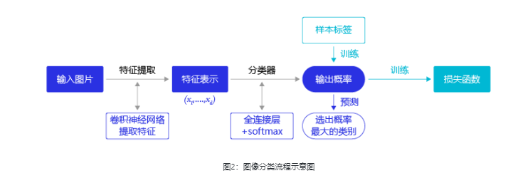
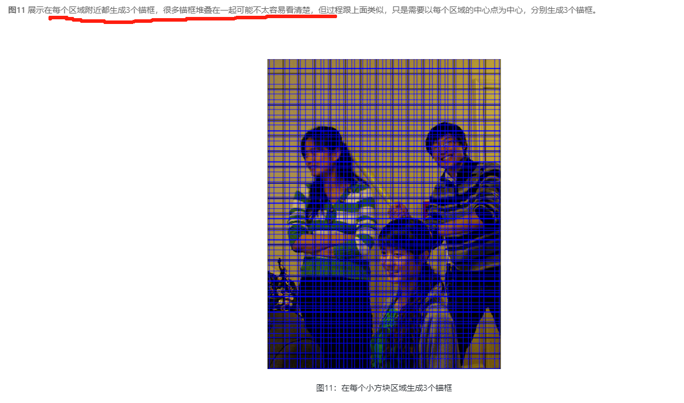
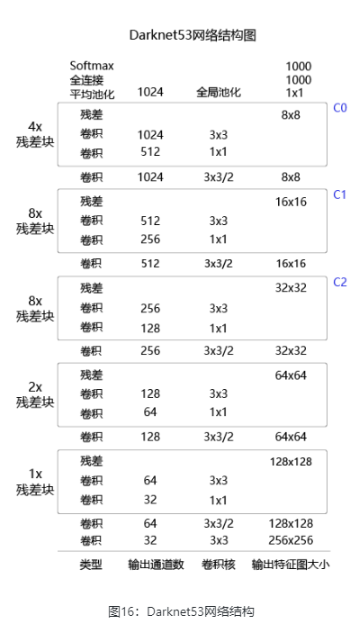

目标检测的主要目的是让计算机可以自动识别图片或者视频帧中所有目标的类别，并在该目标周围绘制边界框，标示出每个目标的位置

对于目标检测问题，按照 **图2** 的流程则行不通，因为在图像分类任务中，对整张图提取特征的过程中没能体现出不同目标之间的区别，最终也就没法分别标示出每个物体所在的位置。

将目标检测任务进行拆分

R-CNN的系列算法分成两个阶段，先在图像上产生候选区域，再对候选区域进行分类并预测目标物体位置，它们通常被叫做两阶段检测算法。

SSD和YOLO算法则只使用一个网络同时产生候选区域并预测出物体的类别和位置，所以它们通常被叫做单阶段检测算法。

# 目标检测基础概念

## 边界框（bounding box）

检测任务需要同时预测物体的类别和位置，边界框（bounding box，bbox）来表示物体的位置，边界框是正好能包含物体的矩形框

两种表示格式：

****(**x**1****,**y**1,**x**2,**y**2)，其中(𝑥1,𝑦1)******是矩形框左上角的坐标，(𝑥2,𝑦2)**是矩形框右下角的坐标

(𝑥,𝑦,𝑤,ℎ)，其中(𝑥,𝑦)****是矩形框中心点的坐标，𝑤是矩形框的宽度，ℎ是矩形框的高度

在检测任务中，训练数据集的标签里会给出目标物体真实边界框所对应的(𝑥1,𝑦1,𝑥2,𝑦2)，这样的边界框也被称为真实框（ground truth box）

## 锚框（Anchor box）

锚框与物体边界框不同，是由人们假想出来的一种框

```
# 画图展示如何绘制边界框和锚框
import numpy as np
import matplotlib.pyplot as plt
import matplotlib.patches as patches
from matplotlib.image import imread
import math

# 定义画矩形框的程序  
def draw_rectangle(currentAxis, bbox, edgecolor = 'k', facecolor = 'y', fill=False, linestyle='-'):
    # currentAxis，坐标轴，通过plt.gca()获取
    # bbox，边界框，包含四个数值的list， [x1, y1, x2, y2]
    # edgecolor，边框线条颜色
    # facecolor，填充颜色
    # fill, 是否填充
    # linestype，边框线型
    # patches.Rectangle需要传入左上角坐标、矩形区域的宽度、高度等参数
    rect=patches.Rectangle((bbox[0], bbox[1]), bbox[2]-bbox[0]+1, bbox[3]-bbox[1]+1, linewidth=1,
                           edgecolor=edgecolor,facecolor=facecolor,fill=fill, linestyle=linestyle)
    currentAxis.add_patch(rect)

  
plt.figure(figsize=(10, 10))

filename = '/home/aistudio/work/images/section3/000000086956.jpg'
im = imread(filename)
plt.imshow(im)

# 使用xyxy格式表示物体真实框
bbox1 = [214.29, 325.03, 399.82, 631.37]
bbox2 = [40.93, 141.1, 226.99, 515.73]
bbox3 = [247.2, 131.62, 480.0, 639.32]

currentAxis=plt.gca()

draw_rectangle(currentAxis, bbox1, edgecolor='r')
draw_rectangle(currentAxis, bbox2, edgecolor='r')
draw_rectangle(currentAxis, bbox3,edgecolor='r')

# 绘制锚框
def draw_anchor_box(center, length, scales, ratios, img_height, img_width):
    """
    以center为中心，产生一系列锚框
    其中length指定了一个基准的长度
    scales是包含多种尺寸比例的list
    ratios是包含多种长宽比的list
    img_height和img_width是图片的尺寸，生成的锚框范围不能超出图片尺寸之外
    """
    bboxes = []
    for scale in scales:
        for ratio in ratios:
            h = length*scale*math.sqrt(ratio)
            w = length*scale/math.sqrt(ratio) 
            x1 = max(center[0] - w/2., 0.)
            y1 = max(center[1] - h/2., 0.)
            x2 = min(center[0] + w/2. - 1.0, img_width - 1.0)
            y2 = min(center[1] + h/2. - 1.0, img_height - 1.0)
            print(center[0], center[1], w, h)
            bboxes.append([x1, y1, x2, y2])

    for bbox in bboxes:
        draw_rectangle(currentAxis, bbox, edgecolor = 'b')

img_height = im.shape[0]
img_width = im.shape[1]  
draw_anchor_box([300., 500.], 100., [2.0], [0.5, 1.0, 2.0], img_height, img_width)


################# 以下为添加文字说明和箭头###############################

plt.text(285, 285, 'G1', color='red', fontsize=20)
plt.arrow(300, 288, 30, 40, color='red', width=0.001, length_includes_head=True, \
         head_width=5, head_length=10, shape='full')

plt.text(190, 320, 'A1', color='blue', fontsize=20)
plt.arrow(200, 320, 30, 40, color='blue', width=0.001, length_includes_head=True, \
         head_width=5, head_length=10, shape='full')

plt.text(160, 370, 'A2', color='blue', fontsize=20)
plt.arrow(170, 370, 30, 40, color='blue', width=0.001, length_includes_head=True, \
         head_width=5, head_length=10, shape='full')

plt.text(115, 420, 'A3', color='blue', fontsize=20)
plt.arrow(127, 420, 30, 40, color='blue', width=0.001, length_includes_head=True, \
         head_width=5, head_length=10, shape='full')

#draw_anchor_box([200., 200.], 100., [2.0], [0.5, 1.0, 2.0])  
plt.show()
```

在目标检测任务中，通常会以某种规则在图片上生成一系列锚框，将这些锚框当成可能的候选区域。模型对这些候选区域是否包含物体进行预测，如果包含目标物体，则还需要进一步预测出物体所属的类别。

还有更为重要的一点是，由于锚框位置是固定的，它不大可能刚好跟物体边界框重合，所以需要在锚框的基础上进行微调以形成能准确描述物体位置的预测框，模型需要预测出微调的幅度。在训练过程中，模型通过学习不断的调整参数，最终能学会如何判别出锚框所代表的候选区域是否包含物体，如果包含物体的话，物体属于哪个类别，以及物体边界框相对于锚框位置需要调整的幅度。

## 交并比——衡量指标

交兵比计算程序

```
# 计算IoU，矩形框的坐标形式为xyxy，这个函数会被保存在box_utils.py文件中
def box_iou_xyxy(box1, box2):
    # 获取box1左上角和右下角的坐标
    x1min, y1min, x1max, y1max = box1[0], box1[1], box1[2], box1[3]
    # 计算box1的面积
    s1 = (y1max - y1min + 1.) * (x1max - x1min + 1.)
    # 获取box2左上角和右下角的坐标
    x2min, y2min, x2max, y2max = box2[0], box2[1], box2[2], box2[3]
    # 计算box2的面积
    s2 = (y2max - y2min + 1.) * (x2max - x2min + 1.)
  
    # 计算相交矩形框的坐标
    xmin = np.maximum(x1min, x2min)
    ymin = np.maximum(y1min, y2min)
    xmax = np.minimum(x1max, x2max)
    ymax = np.minimum(y1max, y2max)
    # 计算相交矩形行的高度、宽度、面积
    inter_h = np.maximum(ymax - ymin + 1., 0.)
    inter_w = np.maximum(xmax - xmin + 1., 0.)
    intersection = inter_h * inter_w
    # 计算相并面积
    union = s1 + s2 - intersection
    # 计算交并比
    iou = intersection / union
    return iou


bbox1 = [100., 100., 200., 200.]
bbox2 = [120., 120., 220., 220.]
iou = box_iou_xyxy(bbox1, bbox2)
print('IoU is {}'.format(iou))  
```

```
IoU is 0.47402644317607107
```

```
# 计算IoU，矩形框的坐标形式为xywh
def box_iou_xywh(box1, box2):
    x1min, y1min = box1[0] - box1[2]/2.0, box1[1] - box1[3]/2.0
    x1max, y1max = box1[0] + box1[2]/2.0, box1[1] + box1[3]/2.0
    s1 = box1[2] * box1[3]

    x2min, y2min = box2[0] - box2[2]/2.0, box2[1] - box2[3]/2.0
    x2max, y2max = box2[0] + box2[2]/2.0, box2[1] + box2[3]/2.0
    s2 = box2[2] * box2[3]

    xmin = np.maximum(x1min, x2min)
    ymin = np.maximum(y1min, y2min)
    xmax = np.minimum(x1max, x2max)
    ymax = np.minimum(y1max, y2max)
    inter_h = np.maximum(ymax - ymin, 0.)
    inter_w = np.maximum(xmax - xmin, 0.)
    intersection = inter_h * inter_w

    union = s1 + s2 - intersection
    iou = intersection / union
    return iou

bbox1 = [100., 100., 200., 200.]
bbox2 = [120., 120., 220., 220.]
iou = box_iou_xywh(bbox1, bbox2)
print('IoU is {}'.format(iou))  
```

```
IoU is 0.6902485659655831
```

# 目标检测YOLOv3

## 林业病虫害数据集和数据预处理方法介绍

### 读取AI识虫数据集标注信息

AI识虫数据集结构如下：

* 提供了2183张图片，其中训练集1693张，验证集245张，测试集245张。
* 包含7种昆虫，分别是Boerner、Leconte、Linnaeus、acuminatus、armandi、coleoptera和linnaeus。
* 包含了图片和标注，请读者先将数据解压，并存放在insects目录下。

```
# 解压数据脚本，第一次运行时打开注释，将文件解压到work目录下
!unzip  -o -q -d  /home/aistudio/work /home/aistudio/data/data19638/insects.zip
```

将数据解压之后，可以看到insects目录下的结构如下所示。

```
    insects
        |---train
        |         |---annotations
        |         |         |---xmls
        |         |                  |---100.xml
        |         |                  |---101.xml
        |         |                  |---...
        |         |
        |         |---images
        |                   |---100.jpeg
        |                   |---101.jpeg
        |                   |---...
        |
        |---val
        |        |---annotations
        |        |         |---xmls
        |        |                  |---1221.xml
        |        |                  |---1277.xml
        |        |                  |---...
        |        |
        |        |---images
        |                  |---1221.jpeg
        |                  |---1277.jpeg
        |                  |---...
        |
        |---test
                 |---images
                           |---1833.jpeg
                           |---1838.jpeg
                           |---...
```

insects包含train、val和test三个文件夹。train/annotations/xmls目录下存放着图片的标注。每个xml文件是对一张图片的说明，包括图片尺寸、包含的昆虫名称、在图片上出现的位置等信息。

* size：图片尺寸。
* object：图片中包含的物体，一张图片可能中包含多个物体。

– name：昆虫名称；

– bndbox：物体真实框；

– difficult：识别是否困难。

```
<annotation>
        <folder>刘霏霏</folder>
        <filename>100.jpeg</filename>
        <path>/home/fion/桌面/刘霏霏/100.jpeg</path>
        <source>
                <database>Unknown</database>
        </source>
        <size>
                <width>1336</width>
                <height>1336</height>
                <depth>3</depth>
        </size>
        <segmented>0</segmented>
        <object>
                <name>Boerner</name>
                <pose>Unspecified</pose>
                <truncated>0</truncated>
                <difficult>0</difficult>
                <bndbox>
                        <xmin>500</xmin>
                        <ymin>893</ymin>
                        <xmax>656</xmax>
                        <ymax>966</ymax>
                </bndbox>
        </object>
        <object>
                <name>Leconte</name>
                <pose>Unspecified</pose>
                <truncated>0</truncated>
                <difficult>0</difficult>
                <bndbox>
                        <xmin>622</xmin>
                        <ymin>490</ymin>
                        <xmax>756</xmax>
                        <ymax>610</ymax>
                </bndbox>
        </object>
        <object>
                <name>armandi</name>
                <pose>Unspecified</pose>
                <truncated>0</truncated>
                <difficult>0</difficult>
                <bndbox>
                        <xmin>432</xmin>
                        <ymin>663</ymin>
                        <xmax>517</xmax>
                        <ymax>729</ymax>
                </bndbox>
        </object>
        <object>
                <name>coleoptera</name>
                <pose>Unspecified</pose>
                <truncated>0</truncated>
                <difficult>0</difficult>
                <bndbox>
                        <xmin>624</xmin>
                        <ymin>685</ymin>
                        <xmax>697</xmax>
                        <ymax>771</ymax>
                </bndbox>
        </object>
        <object>
                <name>linnaeus</name>
                <pose>Unspecified</pose>
                <truncated>0</truncated>
                <difficult>0</difficult>
                <bndbox>
                        <xmin>783</xmin>
                        <ymin>700</ymin>
                        <xmax>856</xmax>
                        <ymax>802</ymax>
                </bndbox>
        </object>
</annotation>
```

下面我们将从数据集中读取xml文件，将每张图片的标注信息读取出来。在读取具体的标注文件之前，我们先完成一件事情，就是将昆虫的类别名字（字符串）转化成数字表示的类别。因为神经网络里面计算时需要的输入类型是数值型的，所以需要将字符串表示的类别转化成具体的数字。昆虫类别名称的列表是：[‘Boerner’, ‘Leconte’, ‘Linnaeus’, ‘acuminatus’, ‘armandi’, ‘coleoptera’, ‘linnaeus’]，这里我们约定此列表中：'Boerner’对应类别0，'Leconte’对应类别1，…，'linnaeus’对应类别6

```
INSECT_NAMES = ['Boerner', 'Leconte', 'Linnaeus', 
                'acuminatus', 'armandi', 'coleoptera', 'linnaeus']

def get_insect_names():
    """
    return a dict, as following,
        {'Boerner': 0,
         'Leconte': 1,
         'Linnaeus': 2, 
         'acuminatus': 3,
         'armandi': 4,
         'coleoptera': 5,
         'linnaeus': 6
        }
    It can map the insect name into an integer label.
    """
    insect_category2id = {}
    for i, item in enumerate(INSECT_NAMES):
        insect_category2id[item] = i

    return insect_category2id
```

```
cname2cid = get_insect_names()
cname2cid
```

```
{'Boerner': 0, 'Leconte': 1, 'Linnaeus': 2, 'acuminatus': 3, 'armandi': 4, 'coleoptera': 5, 'linnaeus': 6}
```

调用get_insect_names函数返回一个dict，描述了昆虫名称和数字类别之间的映射关系。下面的程序从annotations/xml目录下面读取所有文件标注信息。

```
import os
import numpy as np
import xml.etree.ElementTree as ET

def get_annotations(cname2cid, datadir):
    filenames = os.listdir(os.path.join(datadir, 'annotations', 'xmls'))
    records = []
    ct = 0
    for fname in filenames:
        fid = fname.split('.')[0]
        fpath = os.path.join(datadir, 'annotations', 'xmls', fname)
        img_file = os.path.join(datadir, 'images', fid + '.jpeg')
        tree = ET.parse(fpath)

        if tree.find('id') is None:
            im_id = np.array([ct])
        else:
            im_id = np.array([int(tree.find('id').text)])

        objs = tree.findall('object')
        im_w = float(tree.find('size').find('width').text)
        im_h = float(tree.find('size').find('height').text)
        gt_bbox = np.zeros((len(objs), 4), dtype=np.float32)
        gt_class = np.zeros((len(objs), ), dtype=np.int32)
        is_crowd = np.zeros((len(objs), ), dtype=np.int32)
        difficult = np.zeros((len(objs), ), dtype=np.int32)
        for i, obj in enumerate(objs):
            cname = obj.find('name').text
            gt_class[i] = cname2cid[cname]
            _difficult = int(obj.find('difficult').text)
            x1 = float(obj.find('bndbox').find('xmin').text)
            y1 = float(obj.find('bndbox').find('ymin').text)
            x2 = float(obj.find('bndbox').find('xmax').text)
            y2 = float(obj.find('bndbox').find('ymax').text)
            x1 = max(0, x1)
            y1 = max(0, y1)
            x2 = min(im_w - 1, x2)
            y2 = min(im_h - 1, y2)
            # 这里使用xywh格式来表示目标物体真实框
            gt_bbox[i] = [(x1+x2)/2.0 , (y1+y2)/2.0, x2-x1+1., y2-y1+1.]
            is_crowd[i] = 0
            difficult[i] = _difficult

        voc_rec = {
            'im_file': img_file,
            'im_id': im_id,
            'h': im_h,
            'w': im_w,
            'is_crowd': is_crowd,
            'gt_class': gt_class,
            'gt_bbox': gt_bbox,
            'gt_poly': [],
            'difficult': difficult
            }
        if len(objs) != 0:
            records.append(voc_rec)
        ct += 1
    return records
```

```
TRAINDIR = '/home/aistudio/work/insects/train'
TESTDIR = '/home/aistudio/work/insects/test'
VALIDDIR = '/home/aistudio/work/insects/val'
cname2cid = get_insect_names()
records = get_annotations(cname2cid, TRAINDIR)
```

```
len(records)
```

```
1693
```

```
records[0]
```

### 数据读取和预处理

数据预处理是训练神经网络时非常重要的步骤。合适的预处理方法，可以帮助模型更好的收敛并防止过拟合。首先我们需要从磁盘读入数据，然后需要对这些数据进行预处理，为了保证网络运行的速度，通常还要对数据预处理进行加速。

#### 数据读取

前面已经将图片的所有描述信息保存在records中了，其中每一个元素都包含了一张图片的描述，下面的程序展示了如何根据records里面的描述读取图片及标注。

```
# 数据读取
import cv2

def get_bbox(gt_bbox, gt_class):
    # 对于一般的检测任务来说，一张图片上往往会有多个目标物体
    # 设置参数MAX_NUM = 50， 即一张图片最多取50个真实框；如果真实
    # 框的数目少于50个，则将不足部分的gt_bbox, gt_class和gt_score的各项数值全设置为0
    MAX_NUM = 50
    gt_bbox2 = np.zeros((MAX_NUM, 4))
    gt_class2 = np.zeros((MAX_NUM,))
    for i in range(len(gt_bbox)):
        gt_bbox2[i, :] = gt_bbox[i, :]
        gt_class2[i] = gt_class[i]
        if i >= MAX_NUM:
            break
    return gt_bbox2, gt_class2

def get_img_data_from_file(record):
    """
    record is a dict as following,
      record = {
            'im_file': img_file,
            'im_id': im_id,
            'h': im_h,
            'w': im_w,
            'is_crowd': is_crowd,
            'gt_class': gt_class,
            'gt_bbox': gt_bbox,
            'gt_poly': [],
            'difficult': difficult
            }
    """
    im_file = record['im_file']
    h = record['h']
    w = record['w']
    is_crowd = record['is_crowd']
    gt_class = record['gt_class']
    gt_bbox = record['gt_bbox']
    difficult = record['difficult']

    img = cv2.imread(im_file)
    img = cv2.cvtColor(img, cv2.COLOR_BGR2RGB)
			#cv2.cvtColor是OpenCV库中的一个函数，用于将图像从一种颜色空间转换为另一种颜色空间。

    # check if h and w in record equals that read from img
    assert img.shape[0] == int(h), \
             "image height of {} inconsistent in record({}) and img file({})".format(
               im_file, h, img.shape[0])

    assert img.shape[1] == int(w), \
             "image width of {} inconsistent in record({}) and img file({})".format(
               im_file, w, img.shape[1])

    gt_boxes, gt_labels = get_bbox(gt_bbox, gt_class)

    # gt_bbox 用相对值
    gt_boxes[:, 0] = gt_boxes[:, 0] / float(w)
    gt_boxes[:, 1] = gt_boxes[:, 1] / float(h)
    gt_boxes[:, 2] = gt_boxes[:, 2] / float(w)
    gt_boxes[:, 3] = gt_boxes[:, 3] / float(h)
  
    return img, gt_boxes, gt_labels, (h, w)
```

`get_img_data_from_file()`函数可以返回图片数据的数据，它们是图像数据img，真实框坐标gt_boxes，真实框包含的物体类别gt_labels，图像尺寸scales。

#### 数据预处理

在计算机视觉中，通常会对图像做一些随机的变化，产生相似但又不完全相同的样本。主要作用是扩大训练数据集，抑制过拟合，提升模型的泛化能力，常用的方法主要有以下几种：

* 随机改变亮暗、对比度和颜色
* 随机填充
* 随机裁剪
* 随机缩放
* 随机翻转
* 随机打乱真实框排列顺序

numpy 实现这些数据增强方法

#### **随机改变亮暗、对比度和颜色等**

```
import numpy as np
import cv2
from PIL import Image, ImageEnhance  
# ImageEnhanc模块提供了一系列方法来增强图像的特定属性，如亮度、对比度、饱和度和锐度等
import random

# 随机改变亮暗、对比度和颜色等
def random_distort(img):
    # 随机改变亮度
    def random_brightness(img, lower=0.5, upper=1.5):
        e = np.random.uniform(lower, upper)
        return ImageEnhance.Brightness(img).enhance(e)
    # 随机改变对比度
    def random_contrast(img, lower=0.5, upper=1.5):
        e = np.random.uniform(lower, upper)
        return ImageEnhance.Contrast(img).enhance(e)
    # 随机改变颜色
    def random_color(img, lower=0.5, upper=1.5):
        e = np.random.uniform(lower, upper)
        return ImageEnhance.Color(img).enhance(e)

    ops = [random_brightness, random_contrast, random_color]
    np.random.shuffle(ops)

    img = Image.fromarray(img)
    img = ops[0](img)
    img = ops[1](img)
    img = ops[2](img)
    img = np.asarray(img)

    return img

# 定义可视化函数，用于对比原图和图像增强的效果
import matplotlib.pyplot as plt
def visualize(srcimg, img_enhance):
    # 图像可视化
    plt.figure(num=2, figsize=(6,12))
    plt.subplot(1,2,1)
    plt.title('Src Image', color='#0000FF')
    plt.axis('off') # 不显示坐标轴
    plt.imshow(srcimg) # 显示原图片

    # 对原图做 随机改变亮暗、对比度和颜色等 数据增强
    srcimg_gtbox = records[0]['gt_bbox']
    srcimg_label = records[0]['gt_class']

    plt.subplot(1,2,2)
    plt.title('Enhance Image', color='#0000FF')
    plt.axis('off') # 不显示坐标轴
    plt.imshow(img_enhance)


image_path = records[0]['im_file']
print("read image from file {}".format(image_path))
srcimg = Image.open(image_path)
# 将PIL读取的图像转换成array类型
srcimg = np.array(srcimg)

# 对原图做 随机改变亮暗、对比度和颜色等 数据增强
img_enhance = random_distort(srcimg)
visualize(srcimg, img_enhance)
```

```
read image from file /home/aistudio/work/insects/train/images/1123.jpeg
```

#### **随机填充**

```
def random_expand(img,
                  gtboxes,
                  max_ratio=4.,
                  fill=None,
                  keep_ratio=True,
                  thresh=0.5):
    if random.random() > thresh:
        return img, gtboxes

    if max_ratio < 1.0:
        return img, gtboxes

    h, w, c = img.shape
    ratio_x = random.uniform(1, max_ratio)
    if keep_ratio:
        ratio_y = ratio_x
    else:
        ratio_y = random.uniform(1, max_ratio)
    oh = int(h * ratio_y)
    ow = int(w * ratio_x)
    off_x = random.randint(0, ow - w)
    off_y = random.randint(0, oh - h)

    out_img = np.zeros((oh, ow, c))
    if fill and len(fill) == c:
        for i in range(c):
            out_img[:, :, i] = fill[i] * 255.0

    out_img[off_y:off_y + h, off_x:off_x + w, :] = img
    gtboxes[:, 0] = ((gtboxes[:, 0] * w) + off_x) / float(ow)
    gtboxes[:, 1] = ((gtboxes[:, 1] * h) + off_y) / float(oh)
    gtboxes[:, 2] = gtboxes[:, 2] / ratio_x
    gtboxes[:, 3] = gtboxes[:, 3] / ratio_y

    return out_img.astype('uint8'), gtboxes


# 对原图做 随机改变亮暗、对比度和颜色等 数据增强
srcimg_gtbox = records[0]['gt_bbox']
img_enhance, new_gtbox = random_expand(srcimg, srcimg_gtbox)
visualize(srcimg, img_enhance)
```

#### **随机裁剪**

随机裁剪之前需要先定义两个函数，`multi_box_iou_xywh`和 `box_crop`这两个函数将被保存在box_utils.py文件中

`multi_box_iou_xywh` 函数用于计算多个边界框之间的交并比（Intersection over Union，IoU）。输入参数 `box1` 和 `box2` 分别表示两组边界框，每个边界框由四个值表示：左上角 x 坐标、左上角 y 坐标、宽度和高度。函数返回一个数组，其中每个元素表示对应边界框的 IoU 值。

`box_crop` 函数用于对图像进行裁剪，并对裁剪后的边界框进行调整。输入参数 `boxes` 是一个二维数组，每行表示一个边界框，每个边界框由四个值表示：左上角 x 坐标、左上角 y 坐标、宽度和高度。`labels` 是一个一维数组，表示每个边界框对应的标签。`crop` 是一个包含四个值的元组，表示裁剪区域的左上角 x 坐标、左上角 y 坐标、宽度和高度。`img_shape` 是一个包含两个值的元组，表示原始图像的宽度和高度。函数返回三个值：调整后的边界框数组、调整后的标签数组和裁剪后的有效边界框数量。

```
import numpy as np

def multi_box_iou_xywh(box1, box2):
    """
    In this case, box1 or box2 can contain multi boxes.
    Only two cases can be processed in this method:
       1, box1 and box2 have the same shape, box1.shape == box2.shape
       2, either box1 or box2 contains only one box, len(box1) == 1 or len(box2) == 1
    If the shape of box1 and box2 does not match, and both of them contain multi boxes, it will be wrong.
    """
    assert box1.shape[-1] == 4, "Box1 shape[-1] should be 4."
    assert box2.shape[-1] == 4, "Box2 shape[-1] should be 4."


    b1_x1, b1_x2 = box1[:, 0] - box1[:, 2] / 2, box1[:, 0] + box1[:, 2] / 2
    b1_y1, b1_y2 = box1[:, 1] - box1[:, 3] / 2, box1[:, 1] + box1[:, 3] / 2
    b2_x1, b2_x2 = box2[:, 0] - box2[:, 2] / 2, box2[:, 0] + box2[:, 2] / 2
    b2_y1, b2_y2 = box2[:, 1] - box2[:, 3] / 2, box2[:, 1] + box2[:, 3] / 2

    inter_x1 = np.maximum(b1_x1, b2_x1)
    inter_x2 = np.minimum(b1_x2, b2_x2)
    inter_y1 = np.maximum(b1_y1, b2_y1)
    inter_y2 = np.minimum(b1_y2, b2_y2)
    inter_w = inter_x2 - inter_x1
    inter_h = inter_y2 - inter_y1
    inter_w = np.clip(inter_w, a_min=0., a_max=None)
    inter_h = np.clip(inter_h, a_min=0., a_max=None)

    inter_area = inter_w * inter_h
    b1_area = (b1_x2 - b1_x1) * (b1_y2 - b1_y1)
    b2_area = (b2_x2 - b2_x1) * (b2_y2 - b2_y1)

    return inter_area / (b1_area + b2_area - inter_area)

def box_crop(boxes, labels, crop, img_shape):
    x, y, w, h = map(float, crop)
    im_w, im_h = map(float, img_shape)

    boxes = boxes.copy()
    boxes[:, 0], boxes[:, 2] = (boxes[:, 0] - boxes[:, 2] / 2) * im_w, (
        boxes[:, 0] + boxes[:, 2] / 2) * im_w
    boxes[:, 1], boxes[:, 3] = (boxes[:, 1] - boxes[:, 3] / 2) * im_h, (
        boxes[:, 1] + boxes[:, 3] / 2) * im_h

    crop_box = np.array([x, y, x + w, y + h])
    centers = (boxes[:, :2] + boxes[:, 2:]) / 2.0
    mask = np.logical_and(crop_box[:2] <= centers, centers <= crop_box[2:]).all(
        axis=1)

    boxes[:, :2] = np.maximum(boxes[:, :2], crop_box[:2])
    boxes[:, 2:] = np.minimum(boxes[:, 2:], crop_box[2:])
    boxes[:, :2] -= crop_box[:2]
    boxes[:, 2:] -= crop_box[:2]

    mask = np.logical_and(mask, (boxes[:, :2] < boxes[:, 2:]).all(axis=1))
    boxes = boxes * np.expand_dims(mask.astype('float32'), axis=1)
    labels = labels * mask.astype('float32')
    boxes[:, 0], boxes[:, 2] = (boxes[:, 0] + boxes[:, 2]) / 2 / w, (
        boxes[:, 2] - boxes[:, 0]) / w
    boxes[:, 1], boxes[:, 3] = (boxes[:, 1] + boxes[:, 3]) / 2 / h, (
        boxes[:, 3] - boxes[:, 1]) / h

    return boxes, labels, mask.sum()
```

```
# 随机裁剪
def random_crop(img,
                boxes,
                labels,
                scales=[0.3, 1.0],
                max_ratio=2.0,
                constraints=None,
                max_trial=50):
    if len(boxes) == 0:
        return img, boxes

    if not constraints:
        constraints = [(0.1, 1.0), (0.3, 1.0), (0.5, 1.0), (0.7, 1.0),
                       (0.9, 1.0), (0.0, 1.0)]

    img = Image.fromarray(img)
    w, h = img.size
    crops = [(0, 0, w, h)]
    for min_iou, max_iou in constraints:
        for _ in range(max_trial):
            scale = random.uniform(scales[0], scales[1])
            aspect_ratio = random.uniform(max(1 / max_ratio, scale * scale), \
                                          min(max_ratio, 1 / scale / scale))
            crop_h = int(h * scale / np.sqrt(aspect_ratio))
            crop_w = int(w * scale * np.sqrt(aspect_ratio))
            crop_x = random.randrange(w - crop_w)
            crop_y = random.randrange(h - crop_h)
            crop_box = np.array([[(crop_x + crop_w / 2.0) / w,
                                  (crop_y + crop_h / 2.0) / h,
                                  crop_w / float(w), crop_h / float(h)]])

            iou = multi_box_iou_xywh(crop_box, boxes)
            if min_iou <= iou.min() and max_iou >= iou.max():
                crops.append((crop_x, crop_y, crop_w, crop_h))
                break

    while crops:
        crop = crops.pop(np.random.randint(0, len(crops)))
        crop_boxes, crop_labels, box_num = box_crop(boxes, labels, crop, (w, h))
        if box_num < 1:
            continue
        img = img.crop((crop[0], crop[1], crop[0] + crop[2],
                        crop[1] + crop[3])).resize(img.size, Image.LANCZOS)
        img = np.asarray(img)
        return img, crop_boxes, crop_labels
    img = np.asarray(img)
    return img, boxes, labels


# 对原图做 随机改变亮暗、对比度和颜色等 数据增强
srcimg_gtbox = records[0]['gt_bbox']
srcimg_label = records[0]['gt_class']

img_enhance, new_labels, mask = random_crop(srcimg, srcimg_gtbox, srcimg_label)
visualize(srcimg, img_enhance)
```

#### **随机缩放**

```
# 随机缩放
def random_interp(img, size, interp=None):
    interp_method = [
        cv2.INTER_NEAREST,
        cv2.INTER_LINEAR,
        cv2.INTER_AREA,
        cv2.INTER_CUBIC,
        cv2.INTER_LANCZOS4,
    ]
    if not interp or interp not in interp_method:
        interp = interp_method[random.randint(0, len(interp_method) - 1)]
    h, w, _ = img.shape
    im_scale_x = size / float(w)
    im_scale_y = size / float(h)
    img = cv2.resize(
        img, None, None, fx=im_scale_x, fy=im_scale_y, interpolation=interp)
    return img

# 对原图做 随机改变亮暗、对比度和颜色等 数据增强
img_enhance = random_interp(srcimg, 640)
visualize(srcimg, img_enhance)
```

#### **随机翻转**

```
# 随机翻转
def random_flip(img, gtboxes, thresh=0.5):
    if random.random() > thresh:
        img = img[:, ::-1, :]
        gtboxes[:, 0] = 1.0 - gtboxes[:, 0]
    return img, gtboxes


# 对原图做 随机改变亮暗、对比度和颜色等 数据增强
img_enhance, box_enhance = random_flip(srcimg, srcimg_gtbox)
visualize(srcimg, img_enhance)
```

#### **随机打乱真实框排列顺序**

```
# 随机打乱真实框排列顺序
def shuffle_gtbox(gtbox, gtlabel):
    gt = np.concatenate(
        [gtbox, gtlabel[:, np.newaxis]], axis=1)
    idx = np.arange(gt.shape[0])
    np.random.shuffle(idx)
    gt = gt[idx, :]
    return gt[:, :4], gt[:, 4]
```

#### **图像增广方法汇总**

```
# 图像增广方法汇总
def image_augment(img, gtboxes, gtlabels, size, means=None):
    # 随机改变亮暗、对比度和颜色等
    img = random_distort(img)
    # 随机填充
    img, gtboxes = random_expand(img, gtboxes, fill=means)
    # 随机裁剪
    img, gtboxes, gtlabels, = random_crop(img, gtboxes, gtlabels)
    # 随机缩放
    img = random_interp(img, size)
    # 随机翻转
    img, gtboxes = random_flip(img, gtboxes)
    # 随机打乱真实框排列顺序
    gtboxes, gtlabels = shuffle_gtbox(gtboxes, gtlabels)

    return img.astype('float32'), gtboxes.astype('float32'), gtlabels.astype('int32')

img_enhance, img_box, img_label = image_augment(srcimg, srcimg_gtbox, srcimg_label, size=320)
visualize(srcimg, img_enhance)
```

### 使用飞桨高层API快速实现数据增强

我们使用numpy实现了多种数据增强方式。同时飞桨也提供了**拿来即用**的数据增强方法

[paddle.vision.transforms](https://www.paddlepaddle.org.cn/documentation/docs/zh/2.0-rc1/api/paddle/vision/ops/yolo_box_cn.html)  模块 ，transforms模块中提供了数十种数据增强方式，包括亮度增强([adjust_brightness](https://www.paddlepaddle.org.cn/documentation/docs/zh/2.0-rc1/api/paddle/vision/transforms/functional/adjust_brightness_cn.html))，对比度增强([adjust_contrast](https://www.paddlepaddle.org.cn/documentation/docs/zh/2.0-rc1/api/paddle/vision/transforms/functional/adjust_contrast.html))，随机裁剪([RandomCrop](https://www.paddlepaddle.org.cn/documentation/docs/zh/2.0-rc1/api/paddle/vision/transforms/transforms/RandomCrop_cn.html))等等

#### paddle.vision.transforms模块中的数据增强

```
#对图像随机裁剪
# 从paddle.vision.transforms模块中import随机剪切的API RandomCrop
from paddle.vision.transforms import RandomCrop

# RandomCrop是一个python类，需要事先声明
#RandomCrop还需要传入剪切的形状，这里设置为640
transform = RandomCrop(640)
# 将图像转换为PIL.Image格式
srcimg = Image.fromarray(np.array(srcimg))
# 调用声明好的API实现随机剪切
img_res = transform(srcimg)
# 可视化结果
visualize(srcimg, np.array(img_res))
```

#### 用飞桨高层API实现亮度增强

```
from paddle.vision.transforms import BrightnessTransform

# BrightnessTransform是一个python类，需要事先声明
transform = BrightnessTransform(0.4)
# 将图像转换为PIL.Image格式
srcimg = Image.fromarray(np.array(srcimg))
# 调用声明好的API实现随机剪切
img_res = transform(srcimg)
# 可视化结果
visualize(srcimg, np.array(img_res))
```

### 批量数据读取与加速

```
# 获取一个批次内样本随机缩放的尺寸
def get_img_size(mode):
    if (mode == 'train') or (mode == 'valid'):
        inds = np.array([0,1,2,3,4,5,6,7,8,9])
        ii = np.random.choice(inds)
        img_size = 320 + ii * 32
    else:
        img_size = 608
    return img_size

# 将 list形式的batch数据 转化成多个array构成的tuple
def make_array(batch_data):
    img_array = np.array([item[0] for item in batch_data], dtype = 'float32')
    gt_box_array = np.array([item[1] for item in batch_data], dtype = 'float32')
    gt_labels_array = np.array([item[2] for item in batch_data], dtype = 'int32')
    img_scale = np.array([item[3] for item in batch_data], dtype='int32')
    return img_array, gt_box_array, gt_labels_array, img_scale
```

。通过使用飞桨提供的[paddle.io.DataLoader](https://www.paddlepaddle.org.cn/documentation/docs/en/develop/api/paddle/io/DataLoader_en.html) API中的num_workers参数设置进程数量，实现多进程读取数据

```
import paddle

# 定义数据读取类，继承Paddle.io.Dataset
class TrainDataset(paddle.io.Dataset):
    def  __init__(self, datadir, mode='train'):
        self.datadir = datadir
        cname2cid = get_insect_names()
        self.records = get_annotations(cname2cid, datadir)
        self.img_size = 640  #get_img_size(mode)

    def __getitem__(self, idx):
        record = self.records[idx]
        # print("print: ", record)
        img, gt_bbox, gt_labels, im_shape = get_img_data(record, size=self.img_size)

        return img, gt_bbox, gt_labels, np.array(im_shape)

    def __len__(self):
        return len(self.records)

# 创建数据读取类
train_dataset = TrainDataset(TRAINDIR, mode='train')

# 使用paddle.io.DataLoader创建数据读取器，并设置batchsize，进程数量num_workers等参数
train_loader = paddle.io.DataLoader(train_dataset, batch_size=2, shuffle=True, num_workers=2, drop_last=True)
```

```
d = paddle.io.DataLoader(train_dataset, batch_size=2, shuffle=True, num_workers=1, drop_last=True)
```

```
img, gt_boxes, gt_labels, im_shape = next(d())
```

```
img.shape, gt_boxes.shape, gt_labels.shape, im_shape.shape
```

```
([2, 3, 640, 640], [2, 50, 4], [2, 50], [2, 2])
```

我们完成了如何查看数据集中的数据、提取数据标注信息、从文件读取图像和标注数据、图像增广、批量读取和加速等过程，通过 `paddle.io.Dataset`可以返回img, gt_boxes, gt_labels, im_shape等数据，接下来就可以将它们输入到神经网络，应用到具体算法上了。

# 单阶段目标检测模型YOLOv3

R-CNN系列算法需要先产生候选区域，再对候选区域做分类和位置坐标的预测，这类算法被称为两阶段目标检测算法。近几年，很多研究人员相继提出一系列单阶段的检测算法，只需要一个网络即可同时产生候选区域并预测出物体的类别和位置坐标。

YOLOv3使用单个网络结构，在产生候选区域的同时即可预测出物体类别和位置，不需要分成两阶段来完成检测任务。

## YOLOv3模型设计思想

YOLOv3算法的基本思想可以分成两部分：

* 按一定规则在图片上产生一系列的候选区域，然后根据这些候选区域与图片上物体真实框之间的位置关系对候选区域进行标注。跟真实框足够接近的那些候选区域会被标注为正样本，同时将真实框的位置作为正样本的位置目标。偏离真实框较大的那些候选区域则会被标注为负样本，负样本不需要预测位置或者类别。
* 使用卷积神经网络提取图片特征并对候选区域的位置和类别进行预测。这样每个预测框就可以看成是一个样本，根据真实框相对它的位置和类别进行了标注而获得标签值，通过网络模型预测其位置和类别，将网络预测值和标签值进行比较，就可以建立起损失函数。

## 产生候选区域

如何产生候选区域，是检测模型的核心设计方案。目前大多数基于卷积神经网络的模型所采用的方式大体如下：

* 按一定的规则在图片上生成一系列位置固定的锚框，将这些锚框看作是可能的候选区域。
* 对锚框是否包含目标物体进行预测，如果包含目标物体，还需要预测所包含物体的类别，以及预测框相对于锚框位置需要调整的幅度。

## 生成锚框

将原始图片划分成𝑚×𝑛个区域，如下图所示，原始图片高度𝐻=640, 宽度𝑊=480，如果我们选择小块区域的尺寸为32×32，则𝑚和𝑛分别为：

𝑚=640/32=20

𝑛=480/32=15

YOLOv3算法会在每个区域的中心，生成一系列锚框



## 生成预测框

锚框的位置都是固定好的，不可能刚好跟物体边界框重合，需要在锚框的基础上进行位置的微调以生成预测框

## 对候选区域进行标注

每个区域可以产生3种不同形状的锚框，每个锚框都是一个可能的候选区域

* 锚框是否包含物体，这可以看成是一个二分类问题，使用标签objectness来表示。当锚框包含了物体时，objectness=1，表示预测框属于正类；当锚框不包含物体时，设置objectness=0，表示锚框属于负类。
* 如果锚框包含了物体，那么它对应的预测框的中心位置和大小应该是多少，或者说上面计算式中的𝑡𝑥,𝑡𝑦,𝑡𝑤,𝑡ℎ应该是多少，使用location标签。
* 如果锚框包含了物体，那么具体类别是什么，这里使用变量label来表示其所属类别的标签。

## 标注预测框的位置坐标标签

当锚框objectness=1时，需要确定预测框位置相对于它微调的幅度，也就是锚框的位置标签。

(𝑡𝑥,𝑡𝑦,𝑡ℎ,𝑡𝑤)是网络预测的输出值，将(𝑑𝑥∗,𝑑𝑦∗,𝑡𝑤∗,𝑡ℎ∗)**作为(𝜎(𝑡𝑥),𝜎(𝑡𝑦),𝑡ℎ,𝑡𝑤)*的目标值，以它们之间的差距作为损失函数，则可以建立起一个回归问题，通过学习网络参数，使得𝑡足够接近𝑡，从而能够求解出预测框的位置。

## 标注锚框包含物体类别的标签

对于objectness=1的锚框，需要确定其具体类别

objectness标注为1的锚框，会有一个真实框跟它对应，该锚框所属物体类别，即是其所对应的真实框包含的物体类别

使用one-hot向量来表示类别标签label。比如一共有10个分类，而真实框里面包含的物体类别是第2类，则label为(0,1,0,0,0,0,0,0,0,0)


对于每个锚框，模型需要预测输出(𝑡𝑥,𝑡𝑦,𝑡𝑤,𝑡ℎ,𝑃𝑜𝑏𝑗,𝑃1,𝑃2,...,𝑃𝐶)，其中𝑃𝑜𝑏𝑗是锚框是否包含物体的概率，𝑃1,𝑃2,...,𝑃𝐶则是锚框包含的物体属于每个类别的概率

## 标注锚框的具体程序

上面描述了如何对预锚框进行标注，但读者可能仍然对里面的细节不太了解，下面将通过具体的程序完成这一步骤。

```
# 标注预测框的objectness
def get_objectness_label(img, gt_boxes, gt_labels, iou_threshold = 0.7,
                         anchors = [116, 90, 156, 198, 373, 326],
                         num_classes=7, downsample=32):
    """
    img 是输入的图像数据，形状是[N, C, H, W]
    gt_boxes，真实框，维度是[N, 50, 4]，其中50是真实框数目的上限，当图片中真实框不足50个时，不足部分的坐标全为0
              真实框坐标格式是xywh，这里使用相对值
    gt_labels，真实框所属类别，维度是[N, 50]
    iou_threshold，当预测框与真实框的iou大于iou_threshold时不将其看作是负样本
    anchors，锚框可选的尺寸
    anchor_masks，通过与anchors一起确定本层级的特征图应该选用多大尺寸的锚框
    num_classes，类别数目
    downsample，特征图相对于输入网络的图片尺寸变化的比例
    """

    img_shape = img.shape
    batchsize = img_shape[0]
    num_anchors = len(anchors) // 2
    input_h = img_shape[2]
    input_w = img_shape[3]
    # 将输入图片划分成num_rows x num_cols个小方块区域，每个小方块的边长是 downsample
    # 计算一共有多少行小方块
    num_rows = input_h // downsample
    # 计算一共有多少列小方块
    num_cols = input_w // downsample

    label_objectness = np.zeros([batchsize, num_anchors, num_rows, num_cols])
    label_classification = np.zeros([batchsize, num_anchors, num_classes, num_rows, num_cols])
    label_location = np.zeros([batchsize, num_anchors, 4, num_rows, num_cols])

    scale_location = np.ones([batchsize, num_anchors, num_rows, num_cols])

    # 对batchsize进行循环，依次处理每张图片
    for n in range(batchsize):
        # 对图片上的真实框进行循环，依次找出跟真实框形状最匹配的锚框
        for n_gt in range(len(gt_boxes[n])):
            gt = gt_boxes[n][n_gt]
            gt_cls = gt_labels[n][n_gt]
            gt_center_x = gt[0]
            gt_center_y = gt[1]
            gt_width = gt[2]
            gt_height = gt[3]
            if (gt_width < 1e-3) or (gt_height < 1e-3):
                continue
            i = int(gt_center_y * num_rows)
            j = int(gt_center_x * num_cols)
            ious = []
            for ka in range(num_anchors):
                bbox1 = [0., 0., float(gt_width), float(gt_height)]
                anchor_w = anchors[ka * 2]
                anchor_h = anchors[ka * 2 + 1]
                bbox2 = [0., 0., anchor_w/float(input_w), anchor_h/float(input_h)]
                # 计算iou
                iou = box_iou_xywh(bbox1, bbox2)
                ious.append(iou)
            ious = np.array(ious)
            inds = np.argsort(ious)
            k = inds[-1]
            label_objectness[n, k, i, j] = 1
            c = gt_cls
            label_classification[n, k, c, i, j] = 1.

            # for those prediction bbox with objectness =1, set label of location
            dx_label = gt_center_x * num_cols - j
            dy_label = gt_center_y * num_rows - i
            dw_label = np.log(gt_width * input_w / anchors[k*2])
            dh_label = np.log(gt_height * input_h / anchors[k*2 + 1])
            label_location[n, k, 0, i, j] = dx_label
            label_location[n, k, 1, i, j] = dy_label
            label_location[n, k, 2, i, j] = dw_label
            label_location[n, k, 3, i, j] = dh_label
            # scale_location用来调节不同尺寸的锚框对损失函数的贡献，作为加权系数和位置损失函数相乘
            scale_location[n, k, i, j] = 2.0 - gt_width * gt_height

    # 目前根据每张图片上所有出现过的gt box，都标注出了objectness为正的预测框，剩下的预测框则默认objectness为0
    # 对于objectness为1的预测框，标出了他们所包含的物体类别，以及位置回归的目标
    return label_objectness.astype('float32'), label_location.astype('float32'), label_classification.astype('float32'), \
             scale_location.astype('float32')
```

```
# 计算IoU，矩形框的坐标形式为xywh
def box_iou_xywh(box1, box2):
    x1min, y1min = box1[0] - box1[2]/2.0, box1[1] - box1[3]/2.0
    x1max, y1max = box1[0] + box1[2]/2.0, box1[1] + box1[3]/2.0
    s1 = box1[2] * box1[3]

    x2min, y2min = box2[0] - box2[2]/2.0, box2[1] - box2[3]/2.0
    x2max, y2max = box2[0] + box2[2]/2.0, box2[1] + box2[3]/2.0
    s2 = box2[2] * box2[3]

    xmin = np.maximum(x1min, x2min)
    ymin = np.maximum(y1min, y2min)
    xmax = np.minimum(x1max, x2max)
    ymax = np.minimum(y1max, y2max)
    inter_h = np.maximum(ymax - ymin, 0.)
    inter_w = np.maximum(xmax - xmin, 0.)
    intersection = inter_h * inter_w

    union = s1 + s2 - intersection
    iou = intersection / union
    return iou 
```

```
# 读取数据
import paddle
reader = paddle.io.DataLoader(train_dataset, batch_size=2, shuffle=True, num_workers=1, drop_last=True)
img, gt_boxes, gt_labels, im_shape = next(reader())
img, gt_boxes, gt_labels, im_shape = img.numpy(), gt_boxes.numpy(), gt_labels.numpy(), im_shape.numpy()

# 计算出锚框对应的标签
label_objectness, label_location, label_classification, scale_location = get_objectness_label(img,
                                                                                              gt_boxes, gt_labels, 
                                                                                              iou_threshold = 0.7,
                                                                                              anchors = [116, 90, 156, 198, 373, 326],
                                                                                              num_classes=7, downsample=32)
```

上面的程序实现了对锚框进行标注，对于每个真实框，选出了与它形状最匹配的锚框，将其objectness标注为1，并且将[𝑑𝑥∗,𝑑𝑦∗,𝑡ℎ∗,𝑡𝑤∗]作为正样本位置的标签，真实框包含的物体类别作为锚框的类别。而其余的锚框，objectness将被标注为0，无需标注出位置和类别的标签。

## 卷积神经网络提取特征

通过连续使用多层卷积和池化等操作，能得到语义含义更加丰富的特征图。在检测问题中，也使用卷积神经网络逐层提取图像特征，通过最终的输出特征图来表征物体位置和类别等信息。

YOLOv3算法使用的骨干网络是Darknet53

在检测任务中，将图中C0后面的平均池化、全连接层和Softmax去掉，保留从输入到C0部分的网络结构，作为检测模型的基础网络结构，也称为骨干网络。YOLOv3模型会在骨干网络的基础上，再添加检测相关的网络模块。



下面的程序是Darknet53骨干网络的实现代码

```
import paddle
import paddle.nn.functional as F
import numpy as np

class ConvBNLayer(paddle.nn.Layer):
    def __init__(self, ch_in, ch_out, 
                 kernel_size=3, stride=1, groups=1,
                 padding=0, act="leaky"):
        super(ConvBNLayer, self).__init__()
  
        self.conv = paddle.nn.Conv2D(
            in_channels=ch_in,
            out_channels=ch_out,
            kernel_size=kernel_size,
            stride=stride,
            padding=padding,
            groups=groups,
            weight_attr=paddle.ParamAttr(
                initializer=paddle.nn.initializer.Normal(0., 0.02)),
            bias_attr=False)
  
        self.batch_norm = paddle.nn.BatchNorm2D(
            num_features=ch_out,
            weight_attr=paddle.ParamAttr(
                initializer=paddle.nn.initializer.Normal(0., 0.02),
                regularizer=paddle.regularizer.L2Decay(0.)),
            bias_attr=paddle.ParamAttr(
                initializer=paddle.nn.initializer.Constant(0.0),
                regularizer=paddle.regularizer.L2Decay(0.)))
        self.act = act

  
    def forward(self, inputs):
        out = self.conv(inputs)
        out = self.batch_norm(out)
        if self.act == 'leaky':
            out = F.leaky_relu(x=out, negative_slope=0.1)
        return out
  
class DownSample(paddle.nn.Layer):
    # 下采样，图片尺寸减半，具体实现方式是使用stirde=2的卷积
    def __init__(self,
                 ch_in,
                 ch_out,
                 kernel_size=3,
                 stride=2,
                 padding=1):

        super(DownSample, self).__init__()

        self.conv_bn_layer = ConvBNLayer(
            ch_in=ch_in,
            ch_out=ch_out,
            kernel_size=kernel_size,
            stride=stride,
            padding=padding)
        self.ch_out = ch_out
    def forward(self, inputs):
        out = self.conv_bn_layer(inputs)
        return out

class BasicBlock(paddle.nn.Layer):
    """
    基本残差块的定义，输入x经过两层卷积，然后接第二层卷积的输出和输入x相加
    """
    def __init__(self, ch_in, ch_out):
        super(BasicBlock, self).__init__()

        self.conv1 = ConvBNLayer(
            ch_in=ch_in,
            ch_out=ch_out,
            kernel_size=1,
            stride=1,
            padding=0
            )
        self.conv2 = ConvBNLayer(
            ch_in=ch_out,
            ch_out=ch_out*2,
            kernel_size=3,
            stride=1,
            padding=1
            )
    def forward(self, inputs):
        conv1 = self.conv1(inputs)
        conv2 = self.conv2(conv1)
        out = paddle.add(x=inputs, y=conv2)
        return out

   
class LayerWarp(paddle.nn.Layer):
    """
    添加多层残差块，组成Darknet53网络的一个层级
    """
    def __init__(self, ch_in, ch_out, count, is_test=True):
        super(LayerWarp,self).__init__()

        self.basicblock0 = BasicBlock(ch_in,
            ch_out)
        self.res_out_list = []
        for i in range(1, count):
            res_out = self.add_sublayer("basic_block_%d" % (i), # 使用add_sublayer添加子层
                BasicBlock(ch_out*2,
                    ch_out))
            self.res_out_list.append(res_out)

    def forward(self,inputs):
        y = self.basicblock0(inputs)
        for basic_block_i in self.res_out_list:
            y = basic_block_i(y)
        return y

# DarkNet 每组残差块的个数，来自DarkNet的网络结构图
DarkNet_cfg = {53: ([1, 2, 8, 8, 4])}

class DarkNet53_conv_body(paddle.nn.Layer):
    def __init__(self):
        super(DarkNet53_conv_body, self).__init__()
        self.stages = DarkNet_cfg[53]
        self.stages = self.stages[0:5]

        # 第一层卷积
        self.conv0 = ConvBNLayer(
            ch_in=3,
            ch_out=32,
            kernel_size=3,
            stride=1,
            padding=1)

        # 下采样，使用stride=2的卷积来实现
        self.downsample0 = DownSample(
            ch_in=32,
            ch_out=32 * 2)

        # 添加各个层级的实现
        self.darknet53_conv_block_list = []
        self.downsample_list = []
        for i, stage in enumerate(self.stages):
            conv_block = self.add_sublayer(
                "stage_%d" % (i),
                LayerWarp(32*(2**(i+1)),
                32*(2**i),
                stage))
            self.darknet53_conv_block_list.append(conv_block)
        # 两个层级之间使用DownSample将尺寸减半
        for i in range(len(self.stages) - 1):
            downsample = self.add_sublayer(
                "stage_%d_downsample" % i,
                DownSample(ch_in=32*(2**(i+1)),
                    ch_out=32*(2**(i+2))))
            self.downsample_list.append(downsample)

    def forward(self,inputs):
        out = self.conv0(inputs)
        #print("conv1:",out.numpy())
        out = self.downsample0(out)
        #print("dy:",out.numpy())
        blocks = []
        for i, conv_block_i in enumerate(self.darknet53_conv_block_list): #依次将各个层级作用在输入上面
            out = conv_block_i(out)
            blocks.append(out)
            if i < len(self.stages) - 1:
                out = self.downsample_list[i](out)
        return blocks[-1:-4:-1] # 将C0, C1, C2作为返回值
```

```
# 查看Darknet53网络输出特征图
import numpy as np
backbone = DarkNet53_conv_body()
x = np.random.randn(1, 3, 640, 640).astype('float32')
x = paddle.to_tensor(x)
C0, C1, C2 = backbone(x)
print(C0.shape, C1.shape, C2.shape)
```

上面这段示例代码，指定输入数据的形状是(1,3,640,640)**，则3个层级的输出特征图的形状分别是𝐶0(1,1024,20,20)**，𝐶1(1,512,40,40)**和𝐶2(1,256,80,80)**。

## 根据输出特征图计算预测框位置和类别

YOLOv3中对每个预测框计算逻辑如下：

* 预测框是否包含物体。也可理解为objectness=1的概率是多少，可以用网络输出一个实数𝑥，可以用𝑆𝑖𝑔𝑚𝑜𝑖𝑑(𝑥)表示objectness为正的概率𝑃𝑜𝑏𝑗
* 预测物体位置和形状。物体位置和形状𝑡𝑥,𝑡𝑦,𝑡𝑤,𝑡ℎ可以用网络输出4个实数来表示𝑡𝑥,𝑡𝑦,𝑡𝑤,𝑡ℎ
* 预测物体类别。预测图像中物体的具体类别是什么，或者说其属于每个类别的概率分别是多少。总的类别数为C，需要预测物体属于每个类别的概率(𝑃1,𝑃2,...,𝑃𝐶)，可以用网络输出C个实数(𝑥1,𝑥2,...,𝑥𝐶)，对每个实数分别求Sigmoid函数，让𝑃𝑖=𝑆𝑖𝑔𝑚𝑜𝑖𝑑(𝑥𝑖)，则可以表示出物体属于每个类别的概率。

对于一个预测框，网络需要输出(5+𝐶)个实数来表征它是否包含物体、位置和形状尺寸以及属于每个类别的概率。

## 建立输出特征图与预测框之间的关联

经过多次卷积核池化之后，其步幅stride=32，640×480大小的输入图片变成了20×15**的特征图；而小方块区域的数目正好是20×15**，也就是说可以让特征图上每个像素点分别跟原图上一个小方块区域对应。这也是为什么我们最开始将小方块区域的尺寸设置为32的原因。
