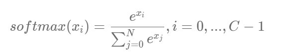

# 实际工业实践中，我们面临的任务和数据环境千差万别，通常需要自己编写合适当前任务的数据处理程序

读入数据

划分数据集

生成批次数据

训练样本集乱序

检验数据有效性

## 1 加载飞桨平台和数据处理库

```
#数据处理部分之前的代码，加入部分数据处理的库
import paddle
from paddle.nn import Linear
import paddle.nn.functional as F
import os
import gzip
import json
import random
import numpy as np
```

## 2读入数据并划分数据集

在实际应用中，保存到本地的数据存储格式多种多样，如MNIST数据集以json格式存储在本地

**data**包含三个元素的列表：train_set、val_set、 test_set，包括50 000条训练样本、10 000条验证样本、10 000条测试样本。每个样本包含手写数字图片和对应的标签。

* **train_set（训练集）** ：用于确定模型参数。
* **val_set（验证集）** ：用于调节模型超参数（如多个网络结构、正则化权重的最优选择）。
* **test_set（测试集）** ：用于估计应用效果（没有在模型中应用过的数据，更贴近模型在真实场景应用的效果）。

**train_set**包含两个元素的列表：train_images、train_labels。

* **train_images** ：[50 000, 784]的二维列表，包含50 000张图片。每张图片用一个长度为784的向量表示，内容是28*28尺寸的像素灰度值（黑白图片）。
* **train_labels** ：[50 000, ]的列表，表示这些图片对应的分类标签，即0~9之间的一个数字。

在本地 `./work/`目录下读取文件名称为 `mnist.json.gz`的MNIST数据，并拆分成训练集、验证集和测试集，实现方法如下所示

```
# 声明数据集文件位置
datafile = './work/mnist.json.gz'
print('loading mnist dataset from {} ......'.format(datafile))
# 加载json数据文件
data = json.load(gzip.open(datafile))
print('mnist dataset load done')
# 读取到的数据区分训练集，验证集，测试集
train_set, val_set, eval_set = data

# 观察训练集数据
imgs, labels = train_set[0], train_set[1]
print("训练数据集数量: ", len(imgs))

# 观察验证集数量
imgs, labels = val_set[0], val_set[1]
print("验证数据集数量: ", len(imgs))

# 观察测试集数量
imgs, labels = val= eval_set[0], eval_set[1]
print("测试数据集数量: ", len(imgs))
```

```
loading mnist dataset from ./work/mnist.json.gz ......
mnist dataset load done
训练数据集数量:  50000
验证数据集数量:  10000
测试数据集数量:  10000
```

那么当我们需要将各种论文中模型复用于工业项目时，应该如何选择呢？给读者一个小建议：当几个模型的准确率在测试集上差距不大时，尽量选择网络结构相对简单的模型。往往越精巧设计的模型和方法，越不容易在不同的数据集之间迁移。

## 3训练样本乱序、生成批次数据

先将样本按顺序进行编号，建立ID集合index_list。然后将index_list乱序，最后按乱序后的顺序读取数据。

通过大量实验发现，模型对最后出现的数据印象更加深刻。训练数据导入后，越接近模型训练结束，最后几个批次数据对模型参数的影响越大。为了避免模型记忆影响训练效果，需要进行样本乱序操作。

* **生成批次数据：** 先设置合理的batch_size，再将数据转变成符合模型输入要求的np.array格式返回。同时，在返回数据时将Python生成器设置为 `yield`模式，以减少内存占用。

```
imgs, labels = train_set[0], train_set[1]
print("训练数据集数量: ", len(imgs))
# 获得数据集长度
imgs_length = len(imgs)
# 定义数据集每个数据的序号，根据序号读取数据
index_list = list(range(imgs_length))
# 读入数据时用到的批次大小
BATCHSIZE = 100

# 随机打乱训练数据的索引序号
random.shuffle(index_list)

# 定义数据生成器，返回批次数据
def data_generator():
    imgs_list = []
    labels_list = []
    for i in index_list:
        # 将数据处理成希望的类型
        img = np.array(imgs[i]).astype('float32')
        label = np.array(labels[i]).astype('float32')
        imgs_list.append(img) 
        labels_list.append(label)
        if len(imgs_list) == BATCHSIZE:
            # 获得一个batchsize的数据，并返回
            yield np.array(imgs_list), np.array(labels_list)
            # 清空数据读取列表
            imgs_list = []
            labels_list = []

    # 如果剩余数据的数目小于BATCHSIZE，
    # 则剩余数据一起构成一个大小为len(imgs_list)的mini-batch
    if len(imgs_list) > 0:
        yield np.array(imgs_list), np.array(labels_list)
    return data_generator
```

```
# 声明数据读取函数，从训练集中读取数据
train_loader = data_generator
# 以迭代的形式读取数据
for batch_id, data in enumerate(train_loader()):
    image_data, label_data = data
    if batch_id == 0:
        # 打印数据shape和类型
        print("打印第一个batch数据的维度:")
        print("图像维度: {}, 标签维度: {}".format(image_data.shape, label_data.shape))
    break
```

在实际应用中，原始数据可能存在标注不准确、数据杂乱或格式不统一等情况。因此在完成数据处理流程后，还需要进行数据校验，一般有两种方式：

* 机器校验：加入一些校验和清理数据的操作。
* 人工校验：先打印数据输出结果，观察是否是设置的格式。再从训练的结果验证数据处理和读取的有效性。

```
imgs_length = len(imgs)

    assert len(imgs) == len(labels), 
          "length of train_imgs({}) should be the same as train_labels({})".format(len(imgs), len(label))
```

## 4封装数据读取与处理函数

我们从读取数据、划分数据集、到打乱训练数据、构建数据读取器以及数据数据校验，完成了一整套一般性的数据处理流程，下面将这些步骤放在一个函数中实现，方便在神经网络训练时直接调用。

```
def load_data(mode='train'):
    datafile = './work/mnist.json.gz'
    print('loading mnist dataset from {} ......'.format(datafile))
    # 加载json数据文件
    data = json.load(gzip.open(datafile))
    print('mnist dataset load done')
   
    # 读取到的数据区分训练集，验证集，测试集
    train_set, val_set, eval_set = data
    if mode=='train':
        # 获得训练数据集
        imgs, labels = train_set[0], train_set[1]
    elif mode=='valid':
        # 获得验证数据集
        imgs, labels = val_set[0], val_set[1]
    elif mode=='eval':
        # 获得测试数据集
        imgs, labels = eval_set[0], eval_set[1]
    else:
        raise Exception("mode can only be one of ['train', 'valid', 'eval']")
    print("训练数据集数量: ", len(imgs))
  
    # 校验数据
    imgs_length = len(imgs)

    assert len(imgs) == len(labels), \
          "length of train_imgs({}) should be the same as train_labels({})".format(len(imgs), len(labels))
  
    # 获得数据集长度
    imgs_length = len(imgs)
  
    # 定义数据集每个数据的序号，根据序号读取数据
    index_list = list(range(imgs_length))
    # 读入数据时用到的批次大小
    BATCHSIZE = 100
  
    # 定义数据生成器
    def data_generator():
        if mode == 'train':
            # 训练模式下打乱数据
            random.shuffle(index_list)
        imgs_list = []
        labels_list = []
        for i in index_list:
            # 将数据处理成希望的类型
            img = np.array(imgs[i]).astype('float32')
            label = np.array(labels[i]).astype('float32')
            imgs_list.append(img) 
            labels_list.append(label)
            if len(imgs_list) == BATCHSIZE:
                # 获得一个batchsize的数据，并返回
                yield np.array(imgs_list), np.array(labels_list)
                # 清空数据读取列表
                imgs_list = []
                labels_list = []
  
        # 如果剩余数据的数目小于BATCHSIZE，
        # 则剩余数据一起构成一个大小为len(imgs_list)的mini-batch
        if len(imgs_list) > 0:
            yield np.array(imgs_list), np.array(labels_list)
    return data_generator
```

定义一层神经网络，利用定义好的数据处理函数，完成神经网络的训练。

```
#数据处理部分之后的代码，数据读取的部分调用Load_data函数
# 定义网络结构，同上一节所使用的网络结构
class MNIST(paddle.nn.Layer):
    def __init__(self):
        super(MNIST, self).__init__()
        # 定义一层全连接层，输出维度是1
        self.fc = paddle.nn.Linear(in_features=784, out_features=1)

    def forward(self, inputs):
        outputs = self.fc(inputs)
        return outputs

# 训练配置，并启动训练过程
def train(model):
    model = MNIST()
    model.train()
    #调用加载数据的函数
    train_loader = load_data('train')
    opt = paddle.optimizer.SGD(learning_rate=0.001, parameters=model.parameters())
    EPOCH_NUM = 10
    for epoch_id in range(EPOCH_NUM):
        for batch_id, data in enumerate(train_loader()):
            #准备数据，变得更加简洁
            images, labels = data
            images = paddle.to_tensor(images)
            labels = paddle.to_tensor(labels) 

            #前向计算的过程
            predits = model(images)
  
            #计算损失，取一个批次样本损失的平均值
            loss = F.square_error_cost(predits, labels)
            avg_loss = paddle.mean(loss)  
  
            #每训练了200批次的数据，打印下当前Loss的情况
            if batch_id % 200 == 0:
                print("epoch: {}, batch: {}, loss is: {}".format(epoch_id, batch_id, avg_loss.numpy()))
  
            #后向传播，更新参数的过程
            avg_loss.backward()
            opt.step()
            opt.clear_grad()

    # 保存模型
    paddle.save(model.state_dict(), './mnist.pdparams')
# 创建模型   
model = MNIST()
# 启动训练过程
train(model)
```

## 5 异步数据读取

* **同步数据读取** ：数据读取与模型训练串行。当模型需要数据时，才运行数据读取函数获得当前批次的数据。在读取数据期间，模型一直等待数据读取结束才进行训练，数据读取速度相对较慢。
* **异步数据读取** ：数据读取和模型训练并行。读取到的数据不断的放入缓存区，无需等待模型训练就可以启动下一轮数据读取。当模型训练完一个批次后，不用等待数据读取过程，直接从缓存区获得下一批次数据进行训练，从而加快了数据读取速度。
* **异步队列** ：数据读取和模型训练交互的仓库，二者均可以从仓库中读取数据，它的存在使得两者的工作节奏可以解耦。

使用飞桨实现异步数据读取非常简单，只需要两个步骤：

1. 构建一个继承paddle.io.Dataset类的数据读取器。
2. 通过paddle.io.DataLoader创建异步数据读取的迭代器。

首先，我们创建定义一个paddle.io.Dataset类，使用随机函数生成一个数据读取器

```
import numpy as np
from paddle.io import Dataset
# 构建一个类，继承paddle.io.Dataset，创建数据读取器
class RandomDataset(Dataset):
    def __init__(self, num_samples):
        # 样本数量
        self.num_samples = num_samples

    def __getitem__(self, idx):
        # 随机产生数据和label
        image = np.random.random([784]).astype('float32')
        label = np.random.randint(0, 9, (1, )).astype('float32')
        return image, label

    def __len__(self):
        # 返回样本总数量
        return self.num_samples
  
# 测试数据读取器
dataset = RandomDataset(10)
for i in range(len(dataset)):
    print(dataset[i])
```

在定义完paddle.io.Dataset后，使用[paddle.io.DataLoader](https://www.paddlepaddle.org.cn/documentation/docs/zh/2.0-rc1/api/paddle/io/DataLoader_cn.html) API即可实现异步数据读取，数据会由Python线程预先读取，并异步送入一个队列中。

```
class paddle.io.DataLoader(dataset, batch_size=100, shuffle=True, num_workers=2)
```

DataLoader支持单进程和多进程的数据加载方式。当 num_workers=0时，使用单进程方式异步加载数据；当 num_workers=n(n>0)时，主进程将会开启n个子进程异步加载数据。 DataLoader返回一个迭代器，迭代的返回dataset中的数据内容；

迭代器是一种设计模式，用于访问容器中的元素。迭代器提供了一种方法来顺序访问一个集合（如列表、元组或字典）中的各个元素，而不需要知道该集合的内部表示。它类似于数组索引，但更通用，因为迭代器可以用于任何类型的集合，而不仅仅是数组。

`enumerate()`是Python中的一个内置函数，用于将一个可迭代对象（如列表、元组或字符串）转换为一个枚举对象。它返回一个枚举对象，其中每个元素都是一个包含索引和值的元组。这个索引表示元素在原始可迭代对象中的位置，而值则是该位置上的元素本身。

使用paddle.io.DataLoader API以batch的方式进行迭代数据，代码如下：

```
loader = paddle.io.DataLoader(dataset, batch_size=3, shuffle=True, drop_last=True, num_workers=2)
for i, data in enumerate(loader()):
    images, labels = data[0], data[1]
    print("batch_id: {}, 训练数据shape: {}, 标签数据shape: {}".format(i, images.shape, labels.shape))
```

# 网格结构优化

## 全连接神经网络

经典的全连接神经网络来包含四层网络：输入层、两个隐含层和输出层，将手写数字识别任务通过全连接神经网络表示

* 输入层：将数据输入给神经网络。在该任务中，输入层的尺度为28×28的像素值。
* 隐含层：增加网络深度和复杂度，隐含层的节点数是可以调整的，节点数越多，神经网络表示能力越强，参数量也会增加。在该任务中，中间的两个隐含层为10×10的结构，通常隐含层会比输入层的尺寸小，以便对关键信息做抽象，激活函数使用常见的Sigmoid函数。【隐含层引入非线性激活函数Sigmoid是为了增加神经网络的非线性能力。】
* 输出层：输出网络计算结果，输出层的节点数是固定的。如果是回归问题，节点数量为需要回归的数字数量。如果是分类问题，则是分类标签的数量。在该任务中，模型的输出是回归一个数字，输出层的尺寸为1。

Sigmoid是早期神经网络模型中常见的非线性变换函数，通过如下代码，绘制出Sigmoid的函数曲线。

```
def sigmoid(x):
    # 直接返回sigmoid函数
    return 1. / (1. + np.exp(-x))
 
# param:起点，终点，间距
x = np.arange(-8, 8, 0.2)
y = sigmoid(x)
plt.plot(x, y)
plt.show()
```

针对手写数字识别的任务，网络层的设计如下：

* 输入层的尺度为28×28，但批次计算的时候会统一加1个维度（大小为batch size）。
* 中间的两个隐含层为10×10的结构，激活函数使用常见的Sigmoid函数。
* 与房价预测模型一样，模型的输出是回归一个数字，输出层的尺寸设置成1。

下述代码为经典全连接神经网络的实现。完成网络结构定义后，即可训练神经网络。

```
import paddle.nn.functional as F
from paddle.nn import Linear

# 定义多层全连接神经网络
class MNIST(paddle.nn.Layer):
    def __init__(self):
        super(MNIST, self).__init__()
        # 定义两层全连接隐含层，输出维度是10，当前设定隐含节点数为10，可根据任务调整
        self.fc1 = Linear(in_features=784, out_features=10)
        self.fc2 = Linear(in_features=10, out_features=10)
        # 定义一层全连接输出层，输出维度是1
        self.fc3 = Linear(in_features=10, out_features=1)
  
    # 定义网络的前向计算，隐含层激活函数为sigmoid，输出层不使用激活函数
    def forward(self, inputs):
        # inputs = paddle.reshape(inputs, [inputs.shape[0], 784])
        outputs1 = self.fc1(inputs)
        outputs1 = F.sigmoid(outputs1)
        outputs2 = self.fc2(outputs1)
        outputs2 = F.sigmoid(outputs2)
        outputs_final = self.fc3(outputs2)
        return outputs_final
```

## 卷积神经网络

卷积神经网络可以直接处理原始形式的图像数据，保留像素间的空间信息，更 适合处理计算机视觉的问题

卷积神经网络由多个卷积层和池化层组成，卷积层负责对输入进行扫描以生成更抽象的特征，池化层更多的对这些特征进行过滤，保留最关键的特征信息。

两层卷积和池化的神经网络实现如下所示

```
# 定义 SimpleNet 网络结构
import paddle
from paddle.nn import Conv2D, MaxPool2D, Linear
import paddle.nn.functional as F
# 多层卷积神经网络实现
class MNIST(paddle.nn.Layer):
     def __init__(self):
         super(MNIST, self).__init__()
   
         # 定义卷积层，输出特征通道out_channels设置为20，卷积核的大小kernel_size为5，卷积步长stride=1，padding=2
         self.conv1 = Conv2D(in_channels=1, out_channels=20, kernel_size=5, stride=1, padding=2)
         # 定义池化层，池化核的大小kernel_size为2，池化步长为2
         self.max_pool1 = MaxPool2D(kernel_size=2, stride=2)
         # 定义卷积层，输出特征通道out_channels设置为20，卷积核的大小kernel_size为5，卷积步长stride=1，padding=2
         self.conv2 = Conv2D(in_channels=20, out_channels=20, kernel_size=5, stride=1, padding=2)
         # 定义池化层，池化核的大小kernel_size为2，池化步长为2
         self.max_pool2 = MaxPool2D(kernel_size=2, stride=2)
         # 定义一层全连接层，输出维度是1
         self.fc = Linear(in_features=980, out_features=1)
   
    # 定义网络前向计算过程，卷积后紧接着使用池化层，最后使用全连接层计算最终输出
    # 卷积层激活函数使用Relu，全连接层不使用激活函数
     def forward(self, inputs):
         x = self.conv1(inputs)
         x = F.relu(x)
         x = self.max_pool1(x)
         x = self.conv2(x)
         x = F.relu(x)
         x = self.max_pool2(x)
         x = paddle.reshape(x, [x.shape[0], -1])
         x = self.fc(x)
         return x
```

# 损失函数的优化

损失函数是模型优化的目标，用于在众多的参数取值中，识别最理想的取值。

损失函数的计算在训练过程的代码中，每一轮模型训练的过程都相同，分如下三步：

1. 先根据输入数据正向计算预测输出。
2. 再根据预测值和真实值计算损失。
3. 最后根据损失反向传播梯度并更新参数。

## 分类任务的损失函数

不同的深度学习任务需要有各自适宜的损失函数。我们以房价预测和手写数字识别两个任务为例，详细剖析其中的缘由如下：

1. 房价预测是回归任务，而手写数字识别是分类任务，使用均方误差作为分类任务的损失函数存在逻辑和效果上的缺欠。
2. 房价可以是大于0的任何浮点数，而手写数字识别的输出只可能是0~9之间的10个整数，相当于一种标签。
3. 在房价预测的案例中，由于房价本身是一个连续的实数值，因此以模型输出的数值和真实房价差距作为损失函数（Loss）是符合道理的。但对于分类问题，真实结果是分类标签，而模型输出是实数值，导致以两者相减作为损失不具备物理含义。

什么是分类任务的合理输出呢？分类任务本质上是“某种特征组合下的分类概率”

医生根据肿瘤大小**x **作为肿瘤性质**y**的参考判断（判断的因素有很多，肿瘤大小只是其中之一），那么我们观测到该模型判断的结果是**x**和**y**的标签（1为恶性，0为良性）。而这个数据背后的规律是不同大小的肿瘤，属于恶性肿瘤的概率。

### Softmax函数

如果模型能输出10个标签的概率，对应真实标签的概率输出尽可能接近100%，而其他标签的概率输出尽可能接近0%，且所有输出概率之和为1。这是一种更合理的假设！与此对应，真实的标签值可以转变成一个10维度的one-hot向量，在对应数字的位置上为1，其余位置为0。

为了实现上述思路，需要引入Softmax函数，它可以将原始输出转变成对应标签的概率，



### 交叉熵

在模型输出为分类标签的概率时，直接以标签和概率做比较也不够合理，人们更习惯使用交叉熵误差作为分类问题的损失衡量

交叉熵损失函数的设计是基于最大似然思想：最大概率得到观察结果的假设是真的。如何理解呢？举个例子来说，如 **图7** 所示。有两个外形相同的盒子，甲盒中有99个白球，1个蓝球；乙盒中有99个蓝球，1个白球。一次试验取出了一个蓝球，请问这个球应该是从哪个盒子中取出的？

### 交叉熵的代码实现

在手写数字识别任务中，仅改动三行代码，就可以将在现有模型的损失函数替换成交叉熵（Cross_entropy）。

* 在读取数据部分，将标签的类型设置成int，体现它是一个标签而不是实数值（飞桨框架默认将标签处理成int64）。
* 在网络定义部分，将输出层改成“输出十个标签的概率”的模式。
* 在训练过程部分，将损失函数从均方误差换成交叉熵。

# 资源配置优化

无论是房价预测任务还是MNIST手写字数字识别任务，训练好一个模型不会超过10分钟，主要原因是我们所使用的神经网络比较简单

实际应用时，常会遇到更加复杂的机器学习或深度学习任务，需要运算速度更高的硬件（如GPU、NPU），甚至同时使用多个机器共同训练一个任务（多卡训练和多机训练）

## 单CPU训练

通过paddle.device.set_device API，设置在GPU上训练还是CPU上训练。

```
paddle.device.set_device (device)
```

参数 device (str)：此参数确定特定的运行设备，可以是 `cpu`、 `gpu:x`或者是 `xpu:x`

## 分布式训练

在工业实践中，很多较复杂的任务需要使用更强大的模型。强大模型加上海量的训练数据，经常导致模型训练耗时严重。比如在计算机视觉分类任务中，训练一个在ImageNet数据集上精度表现良好的模型，大概需要一周的时间，因为过程中我们需要不断尝试各种优化的思路和方案。如果每次训练均要耗时1周，这会大大降低模型迭代的速度。在机器资源充沛的情况下，建议采用分布式训练，大部分模型的训练时间可压缩到小时级别。

分布式训练有两种实现模式：模型并行和数据并行。

### 模型并行

模型并行是将一个网络模型拆分为多份，拆分后的模型分到多个设备上（GPU）训练，每个设备的训练数据是相同的。模型并行的实现模式可以节省内存，但是应用较为受限。

模型并行的方式一般适用于如下两个场景：

1. **模型架构过大：** 完整的模型无法放入单个GPU。如2012年ImageNet大赛的冠军模型AlexNet是模型并行的典型案例，由于当时GPU内存较小，单个GPU不足以承担AlexNet，因此研究者将AlexNet拆分为两部分放到两个GPU上并行训练。
2. **网络模型的结构设计相对独立：** 当网络模型的设计结构可以并行化时，采用模型并行的方式。如在计算机视觉目标检测任务中，一些模型（如YOLO9000）的边界框回归和类别预测是独立的，可以将独立的部分放到不同的设备节点上完成分布式训练。

### 数据并行

数据并行与模型并行不同，数据并行每次读取多份数据，读取到的数据输入给多个设备（GPU）上的模型，每个设备上的模型是完全相同的，飞桨采用的就是这种方式。

当前GPU硬件技术快速发展，深度学习使用的主流GPU的内存已经足以满足大多数的网络模型需求，所以大多数情况下使用数据并行的方式。

#### 梯度同步机制

数据并行的方式与众人拾柴火焰高的道理类似，如果把训练数据比喻为砖头，把一个设备（GPU）比喻为一个人，那单GPU训练就是一个人在搬砖，多GPU训练就是多个人同时搬砖，每次搬砖的数量倍数增加，效率呈倍数提升。值得注意的是，每个设备的模型是完全相同的，但是输入数据不同，因此每个设备的模型计算出的梯度是不同的。如果每个设备的梯度只更新当前设备的模型，就会导致下次训练时，每个模型的参数都不相同。因此我们还需要一个梯度同步机制，保证每个设备的梯度是完全相同的。

梯度同步有两种方式：PRC通信方式和NCCL2通信方式（Nvidia Collective multi-GPU Communication Library）

##### PRC通信方式

PRC通信方式通常用于CPU分布式训练，它有两个节点：参数服务器Parameter server和训练节点Trainer

parameter server收集来自每个设备的梯度更新信息，并计算出一个全局的梯度更新

Trainer用于训练，每个Trainer上的程序相同，但数据不同。当Parameter server收到来自Trainer的梯度更新请求时，统一更新模型的梯度。

##### NCCL2通信方式（Collective）

当前飞桨的GPU分布式训练使用的是基于NCCL2的通信方式

相比PRC通信方式，使用NCCL2（Collective通信方式）进行分布式训练，不需要启动Parameter server进程，每个Trainer进程保存一份完整的模型参数，在完成梯度计算之后通过Trainer之间的相互通信，Reduce梯度数据到所有节点的所有设备，然后每个节点在各自完成参数更新。

飞桨提供了便利的数据并行训练方式，用户只需要对程序进行简单修改，即可实现在多GPU上并行训练。接下来将讲述如何将一个单机程序通过简单的改造，变成单机多卡程序。

###### 单机多卡程序改造

单机多卡程序通过如下两步改动即可完成：

1. 初始化并行环境。
2. 使用paddle.DataParallel封装模型。

可通过继承[paddle.io.Dataset](https://www.paddlepaddle.org.cn/documentation/docs/zh/api/paddle/io/Dataset_cn.html#dataset)的方式准备自己的数据，再通过[DistributedBatchSampler](https://www.paddlepaddle.org.cn/documentation/docs/zh/api/paddle/io/DistributedBatchSampler_cn.html)实现分布式批采样器加载数据的一个子集，这样，每个进程可以传递给DataLoader一个DistributedBatchSampler的实例，每个进程加载原始数据的一个子集。

###### 启动多GPU的训练，有两种方式

1. 基于launch启动；

需要在命令行中 设置参数变量，打开终端，运行：

单机单卡启动，默认使用第0号卡

```
$ python train.py
```

单机多卡启动，默认使用当前可见的所有卡

```
$ python -m paddle.distributed.launch train.py
```

单机多卡启动，设置当前使用的第0号和第1号卡

```
$ python -m paddle.distributed.launch --gpu '0,1' --log_dir ./mylog train.py
```

```
$ export CUDA_VISIABLE_DEVICES='0,1'
$ python -m paddle.distributed.launch train.py
```

相关参数含义如下：

paddle.distirbuted.launch:启动分布式运行

gpus:设置使用的GPU的序号（需要是多GPU卡的机器，通过命令watch nvidia-smi查看GPU的序号）

log_dir:存放训练的Log,若不设置成，每个GPU上的训练信息都会打印到屏幕

train.py：多gpu训练的程序，包含修改过的train_multi_gpu()函数

训练完成后，在指定的./mylog文件夹下会产生四个日志文件


2.基于spawn方式启动。

launch方式启动训练，是以文件为单位启动多进程，需要用户在启动时调用 `paddle.distributed.launch`，对于进程的管理要求较高；飞桨最新版本中，增加了spawn启动方式，可以更好地控制进程，在日志打印、训练和退出时更加友好。spawn方式和launch方式仅在启动上有所区别。


```
# 启动train多进程训练，默认使用所有可见的GPU卡。
if __name__ == '__main__':
    dist.spawn(train)

# 启动train函数2个进程训练，默认使用当前可见的前2张卡。
if __name__ == '__main__':
    dist.spawn(train, nprocs=2)

# 启动train函数2个进程训练，默认使用第4号和第5号卡。
if __name__ == '__main__':
    dist.spawn(train, nprocs=2, selelcted_gpus='4,5')
```
